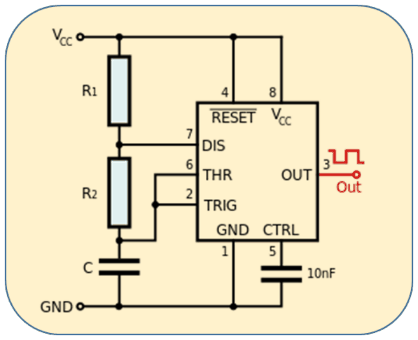
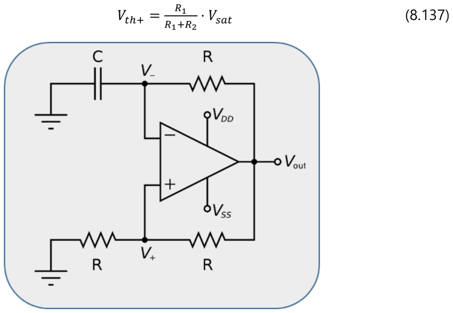
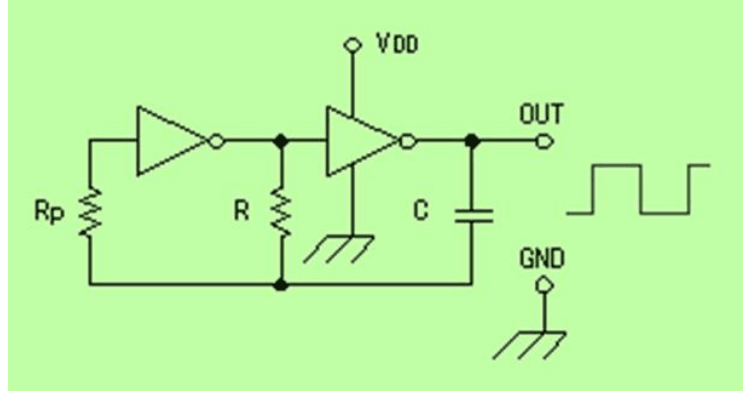
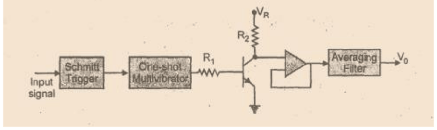

# Mètodes basats en oscil·ladors i mesura de freqüència

## 📑 Índice de Contenidos

- [1 Codificar el mesurand en la freqüència](#1-codificar-el-mesurand-en-la-freqüència)
- [2 Oscil·ladors de relaxació](#2-oscilladors-de-relaxació)
- [3 Conversió freqüència–tensió](#3-conversió-freqüènciatensió)
- [4 Comptatge digital de flancs](#4-comptatge-digital-de-flancs)

---

Sistemes de Mesura · **Unitat 8 — Condicionament de sensors en alterna** · Document 6 de 6

# Mètodes basats en oscil·ladors i mesura de freqüència

Dedicació estimada: 8 minuts

> [!NOTE] **Objectius d'aprenentatge**
>
> - Enunciar els avantatges i els inconvenients de codificar el mesurand en la freqüència.
> - Relacionar el període i la freqüència d'oscil·lació amb la capacitat del sensor en els tres oscil·ladors de relaxació.
> - Aplicar la condició de funcionament del monoestable en la conversió freqüència–tensió.
> - Quantificar el compromís entre resolució i velocitat de resposta en el comptatge digital de flancs.

Tots els mètodes anteriors comparteixen una arquitectura: un oscil·lador sinusoïdal excita un circuit lineal que converteix la impedància en una tensió alterna, i un convertidor alterna–contínua n'extreu l'amplitud. L'alternativa d'aquest document prescindeix del senyal sinusoïdal i de tota la cadena en alterna: **el sensor s'incorpora dins d'un oscil·lador** com a element que en fixa la freqüència, i estimar el mesurand es redueix a mesurar una freqüència.

## 1 Codificar el mesurand en la freqüència

Quan el mesurand canvia, la capacitat  $C(x)$  o la inductància  $L(x)$  del sensor varia i, amb ella, la freqüència d'oscil·lació  $f(x)$. La informació ja no viatja en l'amplitud sinó en la freqüència, una magnitud robusta i mesurable amb gran exactitud.

| Avantatge | Motiu |
|:--- |:--- |
| **Senzillesa del circuit** | L'arquitectura es redueix a un oscil·lador de relaxació i un circuit de mesura de freqüència. No calen amplificadors d'alterna, convertidors RMS, multiplicadors analògics ni filtres precisos: menys components, menys cost, menys superfície de placa i menys fonts d'error. |
| **Sortida digital directa** | La freqüència es mesura amb un comptador digital, sense cap convertidor analògic–digital, cosa que facilita la integració amb microcontroladors i FPGA. |
| **Immunitat a pertorbacions d'amplitud** | Com que la informació rau exclusivament en la freqüència, el soroll, les interferències i les variacions d'alimentació que afectin l'amplitud no tenen cap efecte sobre la mesura. És la característica més valorada en entorns industrials. |

Com a contrapartida, la relació entre freqüència i mesurand és en general **no lineal** —inversament proporcional a  $C(x)$  o a  $\sqrt{L(x)C}$ —, cosa que cal recollir en la calibració; el sistema és sensible a les toleràncies i a la deriva tèrmica dels components passius de temporització; i la mesura de freqüència requereix un temps d'integració que limita la velocitat de resposta.

## 2 Oscil·ladors de relaxació

Per raons de senzillesa no s'empren oscil·ladors sinusoïdals, que exigeixen realimentació més complexa i control d'amplitud, sinó **oscil·ladors de relaxació**: circuits no lineals que generen un senyal quadrat o de pols la freqüència del qual depèn del temps de càrrega i descàrrega d'un element reactiu a través d'una resistència. Quan la tensió al condensador arriba a un llindar superior el circuit commuta i inicia la descàrrega; en arribar al llindar inferior torna a commutar. La freqüència depèn de la constant de temps i, com que  $C$  és el sensor, depèn del mesurand.

*Figura: Figura 8.42 Oscil·lador astable basat en el temporitzador 555.*

En la configuració **astable amb el 555**, el condensador es carrega des de  $V_{\text{CC}}/3$  fins a  $2V_{\text{CC}}/3$  a través de  $R_1+R_2$  amb la sortida a nivell alt, i es descarrega de  $2V_{\text{CC}}/3$  fins a  $V_{\text{CC}}/3$  a través de  $R_2$, mitjançant el transistor intern de descàrrega, amb la sortida a nivell baix. Els temps valen  $t_H = \ln 2\,(R_1+R_2)C$  i  $t_L = \ln 2\,R_2 C$, de manera que

$$
T = \ln 2\,(R_1 + 2R_2)\,C, \qquad f = \frac{1}{T} \approx \frac{1{,}44}{(R_1+2R_2)\,C} \qquad (8.46)
$$

El període és **directament proporcional** a la capacitat del sensor —amb  $C = C_0(1+x)$, proporcional a  $1+x$ — i la freqüència inversament proporcional. L'oscil·lació no té un cicle de treball del 50%

*Figura: Figura 8.43 Oscil·lador de relaxació amb amplificador operacional.*

Un operacional amb **realimentació positiva** actua com a comparador amb histèresi. Amb la sortida a  $+V_{\text{sat}}$, el condensador es carrega a través de  $R$  mentre les dues resistències de realimentació fixen el llindar superior  $V_{th+} = V_{\text{sat}}\,R_1/(R_1+R_2)$. En assolir-lo, la sortida commuta a  $-V_{\text{sat}}$, el llindar passa a  $-V_{th+}$  i el condensador es descarrega. Amb saturacions simètriques i totes les resistències iguals:

$$
f = \frac{1}{2\ln(3)\,R\,C} \qquad (8.47)
$$

Les tensions de saturació depenen de l'alimentació i del model d'operacional, però la simetria dels llindars dona de manera natural un cicle de treball del 50 %, cosa que simplifica el circuit de mesura posterior.

*Figura: Figura 8.44 Oscil·lador basat en inversors CMOS.*

Amb **portes inversores CMOS amb histèresi** —inversors de Schmitt, com els del 74HC14— el funcionament és conceptualment idèntic i la freqüència ideal és la mateixa expressió. És la solució de menor cost i consum: un encapsulat de sis inversors val cèntims i consumeix corrents de l'ordre de µA en repòs, i tota la lògica del comptador pot anar al mateix microcontrolador, de manera que el condicionament extern queda reduït a la porta, la resistència i el sensor. Per contra, els llindars de la histèresi varien amb la tensió d'alimentació i amb la temperatura, cosa que introdueix errors sistemàtics que cal compensar per calibració si es vol alta exactitud.

## 3 Conversió freqüència–tensió

*Figura: Figura 8.45 Conversió freqüència–tensió amb un monoestable.*

L'arquitectura analògica clàssica es basa en un **monoestable**: un biestable amb un únic estat estable que, en rebre un flanc d'activació, commuta a l'estat inestable i hi roman un temps precís  $\tau$  fixat per un condensador intern i una resistència externa, abans de tornar sol a l'estat estable. El resultat és un tren de polsos de durada i amplitud constants, separats pel període de l'oscil·lador. La condició de funcionament correcte és que el pols acabi abans que arribi el flanc següent, en tot el marge de mesura:

$$
\tau < T_{\min} = \frac{1}{f_{\max}} \qquad (8.48)
$$

Si es viola, el monoestable es bloqueja, perd flancs i produeix errors greus. Filtrant el tren de polsos amb un passa-baixes se n'obté el valor mitjà:

$$
V = V_{\text{DD}}\cdot\frac{\tau}{T} = V_{\text{DD}}\cdot\tau\cdot f \qquad (8.49)
$$

directament proporcional a la freqüència i, per tant, al mesurand. Amb  $V_{\text{DD}} = 5$  V i  $\tau = 100$  µs, una freqüència d'1 kHz dona un cicle de treball del 10 % i 0,5 V de sortida, i 5 kHz en donen el 50 % i 2,5 V. A mesura que la freqüència s'aproxima a  $1/\tau = 10$  kHz el cicle de treball tendeix al 100 % i la sortida a  $V_{\text{DD}}$; per damunt de  $f_{\max} = 1/\tau$  el circuit deixa de funcionar.

## 4 Comptatge digital de flancs

L'alternativa digital compta els flancs del senyal de l'oscil·lador durant un interval fixat  $T_{\text{gate}}$:

$$
N = f\cdot T_{\text{gate}} \qquad (8.50)
$$

La resolució és d'un flanc, cosa que correspon a una resolució en freqüència  $\Delta f = 1/T_{\text{gate}}$: amb un temps de porta d'1 s la resolució és d'1 Hz, i amb 10 s de 0,1 Hz. El compromís és immediat, perquè a major temps de porta menor velocitat de resposta —el mesurand no es pot actualitzar més d'una vegada cada  $T_{\text{gate}}$  segons.

El comptador pot ser un perifèric del propi microcontrolador de l'aplicació, en mode captura, i molts microcontroladors industrials incorporen mòduls que mesuren directament el període del senyal entrant amb la resolució temporal del seu rellotge. El comptatge digital és, doncs, la solució preferida sempre que hi hagi un microcontrolador al sistema, condició gairebé universal en instruments moderns; la conversió freqüència–tensió analògica queda per als casos en què cal una sortida analògica contínua sense microcontrolador, com en control analògic o en instruments on la sortida ha de ser una tensió estàndard de 0–10 V o un llaç de 4–20 mA.

> [!TIP] **Síntesi**
>
> Incorporant el sensor dins d'un oscil·lador de relaxació, el mesurand queda codificat en la freqüència: circuit senzill, sortida digital directa i immunitat total a les pertorbacions d'amplitud, a canvi d'una relació no lineal, de sensibilitat a les toleràncies i derives dels components de temporització i d'un temps d'integració que limita la velocitat. En el 555 astable el període val  $\ln 2\,(R_1+2R_2)C$  i el cicle de treball s'allunya del 50 %; amb operacional o amb inversors CMOS amb histèresi la freqüència val  $\frac{1}{2\ln 3\,RC}$  i el cicle de treball és simètric per construcció. Per llegir la freqüència, el monoestable seguit d'un filtre dona  $V = V_{\text{DD}}\tau f$  sempre que la durada del pols sigui menor que el període mínim, i el comptatge de flancs durant  $T_{\text{gate}}$  dona  $N = f\,T_{\text{gate}}$  amb resolució  $1/T_{\text{gate}}$, enfrontant resolució i velocitat de resposta.

[← 5. Detecció coherent: homodina, rectificació síncrona i mostreig síncron](05_Unitat8_Deteccio_coherent.md)

---

## 📐 Formulario Resumen de Ecuaciones

| Nº / Ref | Expresión Matemática |
| :---: | :--- |
| **(8.46)** | $T = \ln 2\,(R_1 + 2R_2)\,C, \qquad f = \frac{1}{T} \approx \frac{1{,}44}{(R_1+2R_2)\,C}$ |
| **(8.47)** | $f = \frac{1}{2\ln(3)\,R\,C}$ |
| **(8.48)** | $\tau < T_{\min} = \frac{1}{f_{\max}}$ |
| **(8.49)** | $V = V_{\text{DD}}\cdot\frac{\tau}{T} = V_{\text{DD}}\cdot\tau\cdot f$ |
| **(8.50)** | $N = f\cdot T_{\text{gate}}$ |