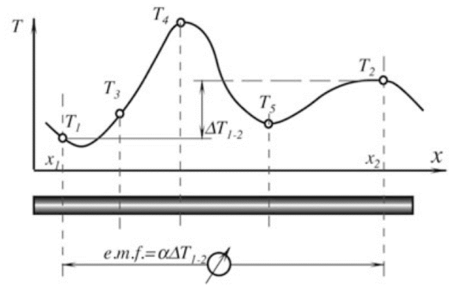
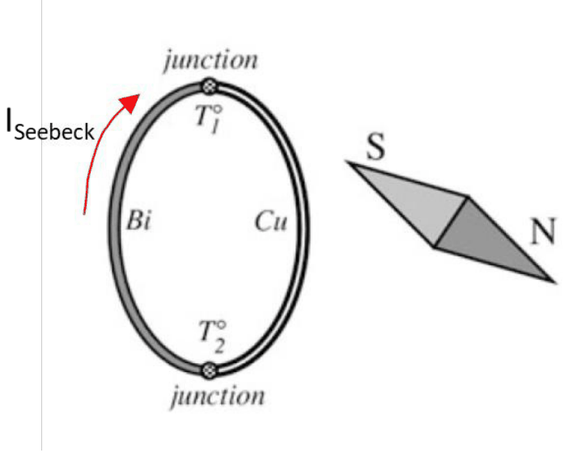
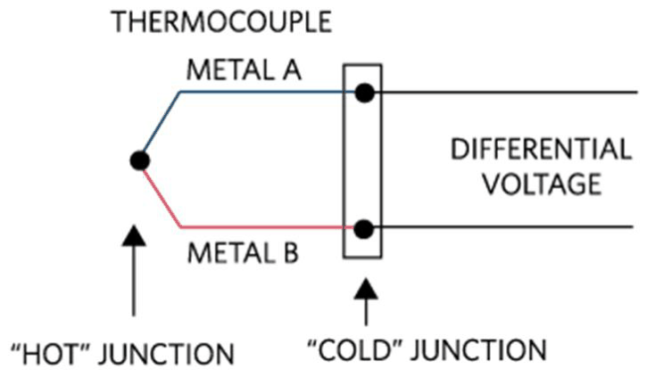
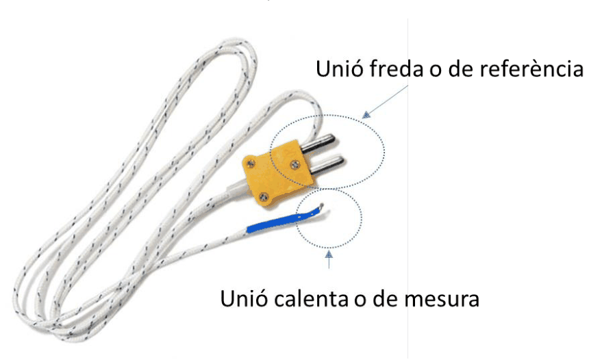
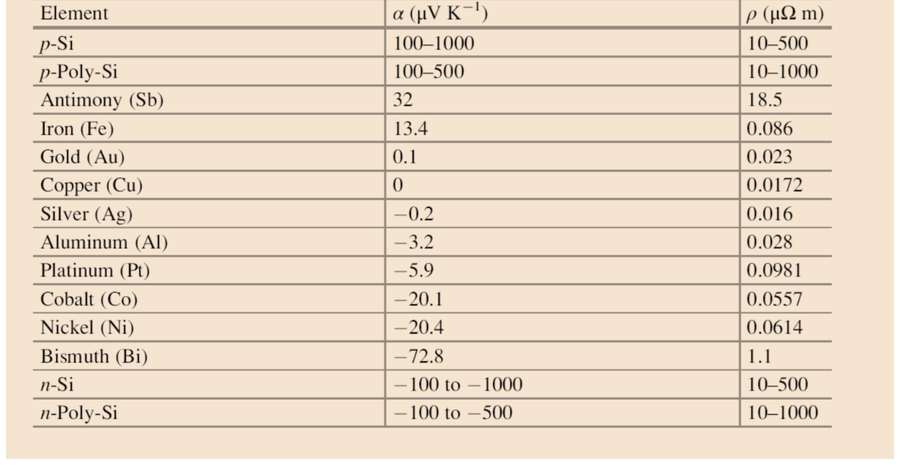
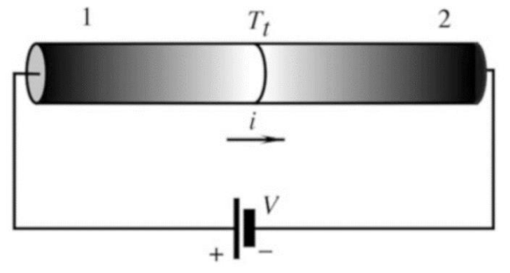

# Sensors generadors i efectes termoelèctrics

## 📑 Índice de Contenidos

- [1 Sensor generador i sensor modulador](#1-sensor-generador-i-sensor-modulador)
- [2 Conseqüències sobre el condicionament](#2-conseqüències-sobre-el-condicionament)
- [3 L'efecte Seebeck](#3-lefecte-seebeck)
- [4 Efectes Peltier i Thomson](#4-efectes-peltier-i-thomson)

---

Sistemes de Mesura · **Unitat 9 — Sensors generadors i unions semiconductores** · Document 1 de 6

# Sensors generadors i efectes termoelèctrics

Dedicació estimada: 9 minuts

> [!NOTE] **Objectius d'aprenentatge**
>
> - Distingir un sensor generador d'un sensor modulador a partir de l'origen de l'energia del senyal de sortida.
> - Associar cada família de sensors generadors al fenomen físic que hi fa la transducció.
> - Deduir del caràcter generador les exigències que recauen sobre el circuit de condicionament.
> - Escriure la tensió d'un termoparell en circuit obert a partir dels coeficients de Seebeck absoluts dels dos materials.
> - Justificar per què el disseny de la lectura d'un termoparell ha de mantenir el corrent per les unions pròxim a zero.

Els sensors resistius de la unitat 5 i els sensors reactius de la unitat 7 modulen una excitació elèctrica aplicada des de l'exterior. Els sensors d'aquesta unitat lliuren directament una tensió o un corrent: l'energia del senyal de sortida prové de la magnitud física mesurada.

## 1 Sensor generador i sensor modulador

|  | Sensor modulador | Sensor generador |
|:--- |:--- |:--- |
| **Excitació elèctrica** | Necessària: el mesurand modifica una excitació externa. | No necessària: la magnitud d'entrada genera el senyal. |
| **Energia del senyal** | Prové de la font d'excitació. | Prové de la magnitud física d'entrada, a través del fenomen de transducció del material. |
| **Magnitud de sortida** | Resistència, capacitat o inductància. | Tensió o càrrega en circuit obert; corrent en curtcircuit. |
| **Geometria** | La sortida hi depèn. | En el termoparell no hi depèn: la tensió la fixen els dos metalls i les temperatures de les unions. |

Les tres famílies de sensors generadors d'aquesta unitat es distingeixen pel fenomen físic que converteix la magnitud d'entrada en senyal elèctric.

| Família | Fenomen | Magnitud mesurada |
|:--- |:--- |:--- |
| **Termoelèctrica** (termoparells) | Efecte Seebeck | Diferència de temperatura entre les dues unions. |
| **Piezoelèctrica** | Efecte piezoelèctric directe | Tensió mecànica: força, pressió, acceleració, impacte. |
| **Piroelèctrica** | Efecte piroelèctric | Flux tèrmic no estacionari, típicament radiació infraroja. |

Els sensors de temperatura basats en unions semiconductores es tracten en aquesta unitat tot i requerir un corrent de polarització constant: aprofiten una propietat intrínseca del material —la dependència de la característica  $i$ – $v$  d'una unió  $p$ - $n$  amb la temperatura— i lliuren una sortida directament interpretable com a temperatura.

El senyal d'un sensor generador és la manifestació directa d'una propietat del material, sense cap amplificació prèvia dins del sensor que hi afegeixi soroll, derives o no linealitats. Aquest tret, sumat a la simplicitat constructiva —dos fils soldats, o una làmina dielèctrica amb dos elèctrodes—, permet fabricar sensors petits, ràpids i aptes per a entorns amb corrosió, vibracions o pressions elevades, i per a marges de temperatura que van de les proximitats de 0 K a més de 1500 °C. Com que no cal portar alimentació fins al punt de mesura, sinó només recollir-ne la tensió amb un parell de cables, el sensor és col·locable allà on alimentar un component seria complicat, costós o perillós.

## 2 Conseqüències sobre el condicionament

El caràcter generador no elimina el circuit de condicionament: en fixa les exigències. Cada família imposa les seves, i un condicionador dissenyat per a una no serveix per a una altra encara que el guany hi sigui el mateix.

| Aspecte | Exigència |
|:--- |:--- |
| **Nivell de senyal** | Desenes de μV/°C en un termoparell, unitats de pC en un sensor piroelèctric: l'offset i la deriva de l'amplificador referits a l'entrada són l'error dominant. |
| **Impedància de font** | Desenes d'ohm en un termoparell; GΩ o TΩ en paral·lel amb pocs pF en els sensors piezoelèctrics i piroelèctrics. |
| **Càrrega del sensor** | Cal llegir carregant tan poc com sigui possible. En els sensors capacitius d'alta impedància, la impedància d'entrada del circuit modifica directament la banda de treball. |
| **Banda de treball** | Els sensors piezoelèctrics i piroelèctrics tenen resposta passa-alt i no mesuren magnituds estàtiques; el termoparell respon en contínua. |

## 3 L'efecte Seebeck

En un metall, els electrons de conducció es comporten en primera aproximació com un gas d'electrons lliures amb una distribució d'energies que depèn de la temperatura. Si hi ha un gradient tèrmic, la difusió porta més electrons de la zona calenta cap a la freda que a l'inrevés; s'acumula càrrega negativa a la zona freda fins que el camp elèctric resultant compensa la difusió. Macroscòpicament apareix una diferència de tensió proporcional a la diferència de temperatura entre els extrems del conductor.

*Figura: Figura 9.1 Tensió associada a un gradient de temperatura en un conductor homogeni.*

> [!WARNING] **Coeficient de Seebeck absolut**
>
> Constant de proporcionalitat entre la diferència de tensió i la diferència de temperatura entre dos punts d'un **conductor homogeni**, denotada  $\alpha$  o  $S$  i expressada en V/K. És una propietat local d'un únic material. En semiconductors pot ser molt més gran que en metalls, i el dopatge en fixa el signe, fet que els fa útils en termopiles i en cèl·lules Peltier.

Seebeck va observar el 1821 que, unint dos conductors diferents en dos punts mantinguts a temperatures diferents, apareix un corrent capaç de desviar l'agulla d'una brúixola propera. La lectura moderna és que els dos conductors, amb coeficients absoluts diferents, generen forces electromotrius diferents davant del mateix gradient, de manera que la suma al voltant del circuit tancat no és nul·la.

*Figura: Figura 9.2 Formulació original de l'efecte Seebeck.*

La formulació útil per al termoparell és la de circuit obert: els dos conductors s'uneixen en un sol punt, situat a la temperatura  $T_1$, i els dos extrems lliures es mantenen tots dos a la mateixa temperatura  $T_2$. El punt d'unió és la **unió calenta** o de mesura; els dos extrems oposats formen la **unió freda** o de referència, tot i que no estan units elèctricament entre ells. Entre els extrems oberts apareix

$$
V_y = (\alpha_1 - \alpha_2)(T_1 - T_2) \qquad (9.1)
$$

*Figura: Figura 9.3 Efecte Seebeck en circuit obert, aplicació directa als termoparells.*

*Figura: Figura 9.4 Exemple de termoparell comercial.*

La tensió mesurable queda determinada per la parella de materials i per les temperatures dels punts de connexió, i és independent del camí tèrmic que segueixen els cables entremig i de la geometria del sensor. Aquesta propietat és conseqüència directa del fet que el coeficient de Seebeck absolut és una propietat local, i és la que fa els termoparells utilitzables en entorns industrials on la distribució tèrmica al llarg del cablejat és incontrolable.

La magnitud rellevant per a un termoparell format pels materials 1 i 2 és el **coeficient de Seebeck diferencial**:

$$
\alpha_{12}(T) = \alpha_1(T) - \alpha_2(T) \qquad (9.2)
$$

*Figura: Figura 9.5 Coeficients de Seebeck absoluts de diversos conductors, prenent el coure com a referència.*

Els coeficients absoluts a l'entorn de 0 °C van de valors molt negatius, com el del bismut, a valors positius, com el de l'antimoni, i passen per zero en alguns metalls. Una sensibilitat elevada demana, doncs, dos materials amb coeficients de signe oposat, de manera que  $\alpha_{12}$  sigui tan gran com sigui possible: d'aquí que els termoparells normalitzats combinin parelles concretes d'aliatges dissenyats per a coeficients elevats i estables.

Tots dos coeficients absoluts depenen de la temperatura, i per tant  $\alpha_{12}(T)$  també: la resposta global del termoparell és no lineal. Per conveniència metrològica els coeficients absoluts es tabulen sovint respecte del **platí**, per la seva puresa i estabilitat química: el que es mesura experimentalment és la tensió del termoparell format pel material d'interès i el platí, i d'aquí se'n dedueix el coeficient absolut un cop descomptada la contribució del platí.

## 4 Efectes Peltier i Thomson

Quan un corrent  $I$  travessa la unió entre dos materials diferents, s'hi absorbeix o s'hi allibera calor amb una potència proporcional a  $\Pi_{12} I$, on  $\Pi_{12} = (\alpha_1 - \alpha_2) T$  és el coeficient de Peltier de la unió. El sentit del flux de calor depèn del sentit del corrent.

*Figura: Figura 9.6 Efecte Peltier.*

L'efecte Thomson descriu l'intercanvi de calor associat a la circulació d'un corrent per un conductor *homogeni* sotmès a un gradient de temperatura: el conductor absorbeix o allibera calor al llarg del recorregut en proporció al producte del corrent pel gradient, amb el coeficient de Thomson del material com a constant. Els tres coeficients estan lligats per les relacions de Kelvin.

| Efecte | Origen | Paper en la mesura |
|:--- |:--- |:--- |
| **Seebeck** | Gradient de temperatura en un conductor. | Principi de mesura del termoparell. |
| **Peltier** | Corrent a través d'una unió entre dos materials. | Font d'error: escalfa o refreda la unió de mesura, que deixa d'estar a la temperatura que es vol mesurar. Creix amb la sensibilitat del termoparell, perquè  $\Pi_{12}$  és proporcional a  $\alpha_{12}$. |
| **Thomson** | Corrent en un conductor homogeni amb gradient tèrmic. | Font d'error del mateix ordre de tractament que el Peltier. |

Tots dos errors s'eliminen mantenint el corrent per les unions pròxim a zero, cosa que exigeix amplificadors amb corrents de polarització molt baixos i impedàncies d'entrada molt elevades. La restricció encaixa amb la naturalesa generadora del dispositiu: la informació s'extreu llegint la tensió en circuit obert.

> [!TIP] **Síntesi**
>
> Un sensor generador lliura tensió o càrrega sense excitació elèctrica externa, i l'energia del senyal prové de la magnitud mesurada: termoparells per efecte Seebeck, sensors piezoelèctrics per tensió mecànica i sensors piroelèctrics per flux tèrmic. El coeficient de Seebeck absolut  $\alpha$  és una propietat local d'un conductor homogeni; en un termoparell la magnitud rellevant és el diferencial  $\alpha_{12} = \alpha_1 - \alpha_2$, i la tensió en circuit obert queda determinada per la parella de materials i per les temperatures de les dues unions, amb independència de la geometria i del camí tèrmic dels cables. Com que  $\alpha_{12}$  depèn de la temperatura, la resposta és no lineal. Els efectes Peltier i Thomson apareixen quan circula corrent i són fonts d'error que es mantenen negligibles llegint el sensor en obert.

[2. El termoparell: resposta, tipus normalitzats i conversió tensió–temperatura →](02_Unitat_El_termoparell_tipus_i_conversio.md)

---

## 📐 Formulario Resumen de Ecuaciones

| Nº / Ref | Expresión Matemática |
| :---: | :--- |
| **(9.1)** | $V_y = (\alpha_1 - \alpha_2)(T_1 - T_2)$ |
| **(9.2)** | $\alpha_{12}(T) = \alpha_1(T) - \alpha_2(T)$ |