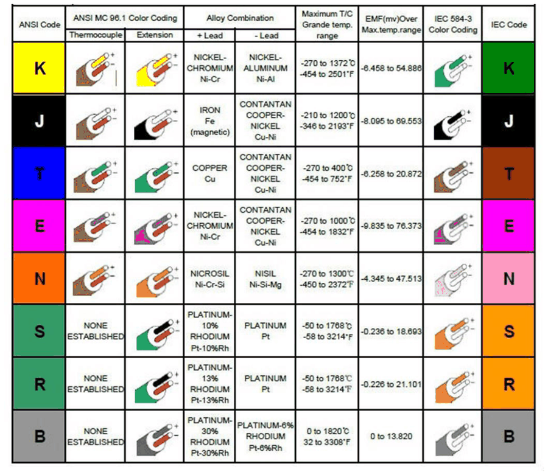
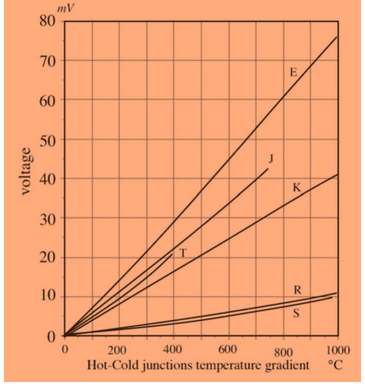
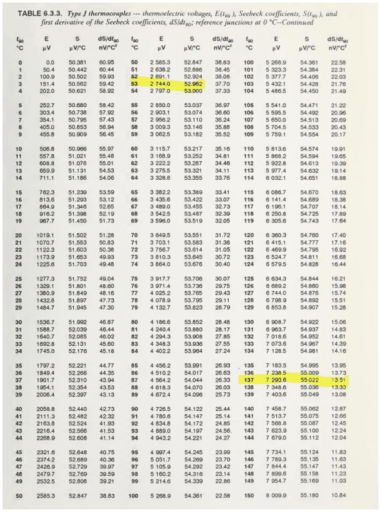

# El termoparell: resposta, tipus normalitzats i conversió tensió–temperatura

## 📑 Índice de Contenidos

- [1 Principi de funcionament](#1-principi-de-funcionament)
- [2 Tipus normalitzats](#2-tipus-normalitzats)
- [3 Conversió tensió–temperatura](#3-conversió-tensiótemperatura)

---

Sistemes de Mesura · **Unitat 9 — Sensors generadors i unions semiconductores** · Document 2 de 6

# El termoparell: resposta, tipus normalitzats i conversió tensió–temperatura

Dedicació estimada: 7 minuts

> [!NOTE] **Objectius d'aprenentatge**
>
> - Escriure la tensió d'un termoparell com a integral del coeficient de Seebeck diferencial i identificar-ne l'aproximació lineal.
> - Justificar per què un termoparell mesura diferència de temperatura i no temperatura absoluta.
> - Emprar el model circuital del termoparell per anticipar el seu comportament davant del circuit de lectura.
> - Triar un tipus normalitzat a partir del marge de temperatura, l'entorn químic, la sensibilitat i el cost.
> - Convertir una tensió mesurada en temperatura amb les taules i els polinomis de la norma.

## 1 Principi de funcionament

Un termoparell són dos conductors de natura diferent units elèctricament en un punt. El punt d'unió física és la **unió calenta** o de mesura, i es col·loca allà on es vol conèixer la temperatura. Els dos extrems lliures constitueixen la **unió freda** o de referència, on no hi ha cap unió física entre els dos metalls; el requisit és que tots dos extrems estiguin a la *mateixa* temperatura. El sensor té, doncs, tres punts tèrmicament rellevants: dos a la temperatura de referència i un a la temperatura a mesurar.

La tensió entre els extrems lliures val

$$
V = \int_{T_r}^{T_o} \alpha_{12}(T)\,dT \qquad (9.3)
$$

és a dir, la integral del coeficient de Seebeck diferencial entre la temperatura de la unió freda  $T_r$  i la de la unió calenta  $T_o$. Si  $\alpha_{12}$  fos constant, l'expressió es reduiria a

$$
V \approx \alpha_{12}\,(T_o - T_r) \qquad (9.4)
$$

La tensió mesurable és proporcional a la **diferència** de temperatura entre les dues unions. Coneixent  $T_r$  es pot deduir  $T_o$; si  $T_r$  no es coneix, cal un mètode addicional per determinar-la.

Com que  $\alpha_{12}(T)$  depèn de la temperatura, la relació entre  $V$  i  $\Delta T$  presenta una curvatura que depèn del tipus de termoparell: el tipus J és bastant lineal dins del seu marge, mentre que el tipus T té una curvatura més pronunciada. L'exactitud requerida s'obté amb les taules o les aproximacions polinòmiques de la norma.

> [!WARNING] **Model circuital**
>
> Font de tensió ideal que lliura  $V$  en funció de  $T_o$  i  $T_r$, en sèrie amb la resistència òhmica dels fils metàl·lics, normalment inferior a algunes desenes d'ohm. Se'n deriven tres conseqüències: la impedància de sortida és negligible davant de la d'entrada de qualsevol amplificador raonable, de manera que la càrrega és poc crítica; la lectura s'ha de fer en obert perquè els efectes Peltier i Thomson es mantinguin negligibles; i qualsevol tensió termoelèctrica paràsita introduïda en sèrie per altres unions se suma directament a la del sensor.

## 2 Tipus normalitzats

La normalització dels termoparells —ANSI i IEC, amb la norma IEC 584-3— fixa la composició exacta dels materials, defineix els codis de colors que identifiquen cada tipus i la branca positiva i la negativa de cada parella, especifica el marge de temperatura d'utilització i proporciona taules i polinomis tensió–temperatura respecte d'una temperatura de referència, típicament 0 °C.

La conseqüència pràctica és la **intercanviabilitat**: un termoparell d'un tipus donat comprat a qualsevol fabricant que compleixi la norma es comporta pràcticament igual que qualsevol altre del mateix tipus, cosa que evita el calibratge individual en moltes aplicacions i permet substituir sensors al camp sense reajustar el condicionament. Aquest grau d'intercanviabilitat exigeix pureses i composicions d'aliatge molt controlades —la puresa del ferro en un tipus J, les toleràncies dels percentatges en un tipus K—, i és també l'origen del seu cost.

La norma IEC 584-3 reconeix vuit termoparells normalitzats: B, E, J, K, N, R, S i T. Per a aplicacions molt específiques s'empren altres tipus, com el C o el G.

*Figura: Figura 9.7 Termoparells normalitzats: codi de colors, aliatges, marge de temperatura i marge de tensió de sortida.*

*Figura: Figura 9.8 Funció de resposta dels termoparells normalitzats, amb la unió freda a 0 °C.*

| Tipus | Materials | Marge típic | Sensibilitat i tret distintiu |
|:--- |:--- |:--- |:--- |
| **J** | Ferro–constantan | −210 °C a +1200 °C | De l'ordre de 50 μV/°C i bona linealitat. Molt utilitzat a temperatures mitjanes. |
| **K** | Cromel–alumel | −270 °C a +1372 °C | De l'ordre de 40 μV/°C. El més utilitzat, per l'ampli rang, la resistència a l'oxidació i el cost moderat. |
| **T** | Coure–constantan | −270 °C a +400 °C | Més no linealitat que el J; molt bona resistència a entorns humits i útil a temperatures baixes. |
| **E** | Cromel–constantan | Temperatures mitjanes | Més de 70 μV/°C: la sensibilitat més alta dels tipus habituals. |
| **N** | Nicrosil–nisil | Fins a l'entorn de 1300 °C | Alternativa al K amb millor estabilitat a alta temperatura. |
| **R, S, B** | Platí i platí–rodi de diferents composicions | Fins a més de 1800 °C | Unes 10 μV/°C i cost elevat. Metal·lúrgia i forns de vidre. |

La tria del tipus la dominen quatre factors: el marge de temperatura requerit, la composició química de l'entorn —oxigen, atmosferes reductores, sofre—, la sensibilitat desitjada i el cost admissible. Com a regla general, temperatures mitjanes en ambients moderadament agressius demanen un J o un K; temperatures baixes, un T; temperatures molt elevades, un R, un S o un B; i precisió a alta temperatura amb estabilitat millorada, un N. Cal comprovar també la disponibilitat de cables d'extensió i de compensació del tipus escollit.

Els fabricants ofereixen els mateixos materials sensors encapsulats en beines d'acer inoxidable, Inconel o ceràmica, de manera que un mateix tipus serveix per a entorns molt diferents segons la protecció. La beina, però, augmenta la constant de temps del conjunt i alenteix la resposta temporal del sensor.

## 3 Conversió tensió–temperatura

Per a cada tipus, la norma proporciona dos instruments: les **taules** tensió–temperatura amb resolució típica d'1 °C i les **aproximacions polinòmiques** de la temperatura en funció de la tensió, i inverses. Tots dos assumeixen la unió freda a 0 °C.

$$
T = c_0 + c_1 x + c_2 x^2 + \cdots + c_n x^n \qquad (9.5)
$$

on  $x$  és la tensió mesurada amb la unió freda a 0 °C i  $T$  la temperatura de la unió calenta. L'ordre del polinomi i l'error màxim dins del marge de mesura depenen del tipus. Aquests polinomis es programen dins del firmware del sistema de mesura i són la manera més pràctica d'obtenir la temperatura un cop compensada la unió freda.

*Figura: Figura 9.9 Taula de referència d'un termoparell normalitzat de tipus J, amb la unió freda a 0 °C.*

| Dada | Resultat |
|:--- |:--- |
| Unió calenta a 137 °C | 7,294 mV |
| Tensió mesurada de 2,744 mV | 53 °C |
| Tensió mesurada de 2,500 mV, entre els 2,480 mV dels 48 °C i els 2,533 mV dels 49 °C | 48,38 °C per interpolació lineal |

La resolució de la taula és limitada: en molts casos la tensió mesurada cau entre dos valors tabulats i cal interpolar. La interpolació lineal, equivalent a suposar la relació tensió–temperatura lineal dins d'un interval d'1 °C, deixa l'error per resolució de taula molt per sota de 0,5 °C per a la majoria de tipus normalitzats. En una implementació digital és habitual partir directament del polinomi de la norma.

> [!TIP] **Síntesi**
>
> La tensió d'un termoparell és la integral del coeficient de Seebeck diferencial entre la temperatura de la unió freda i la de la unió calenta, i es redueix a  $V \approx \alpha_{12}\Delta T$  quan  $\alpha_{12}$  es pot considerar constant: el sensor lliura informació de la diferència de temperatura entre les dues unions. El model circuital és una font de tensió amb una resistència de sortida de desenes d'ohm, de manera que la càrrega és poc crítica però qualsevol tensió termoelèctrica paràsita en sèrie se suma a la del sensor. La norma IEC 584-3 reconeix vuit tipus —B, E, J, K, N, R, S, T—, en garanteix la intercanviabilitat i en proporciona taules i polinomis referits a una unió freda a 0 °C; la tria del tipus combina marge de temperatura, entorn químic, sensibilitat i cost.

[← 1. Sensors generadors i efectes termoelèctrics](01_Unitat9_Sensors_generadors_i_efectes_termoelectrics.md)[3. Lleis termoelèctriques, compensació de la unió freda i prestacions →](03_Unitat9_Lleis_unio_freda_i_prestacions.md)

---

## 📐 Formulario Resumen de Ecuaciones

| Nº / Ref | Expresión Matemática |
| :---: | :--- |
| **(9.3)** | $V = \int_{T_r}^{T_o} \alpha_{12}(T)\,dT$ |
| **(9.4)** | $V \approx \alpha_{12}\,(T_o - T_r)$ |
| **(9.5)** | $T = c_0 + c_1 x + c_2 x^2 + \cdots + c_n x^n$ |