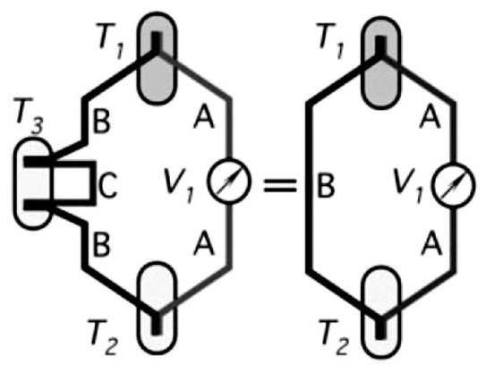
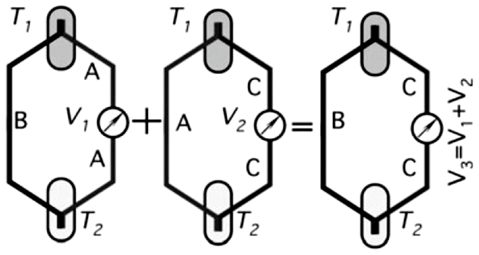
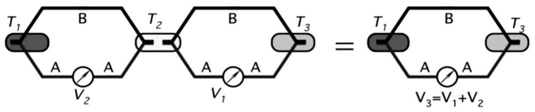
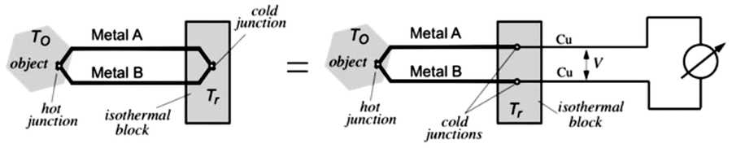
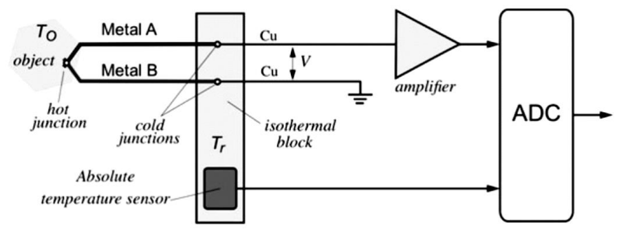

# Lleis termoelèctriques, compensació de la unió freda i prestacions

## 📑 Índice de Contenidos

- [1 Lleis termoelèctriques](#1-lleis-termoelèctriques)
- [2 Compensació de la unió freda](#2-compensació-de-la-unió-freda)
- [3 Prestacions i limitacions](#3-prestacions-i-limitacions)

---

Sistemes de Mesura · **Unitat 9 — Sensors generadors i unions semiconductores** · Document 3 de 6

# Lleis termoelèctriques, compensació de la unió freda i prestacions

Dedicació estimada: 8 minuts

> [!NOTE] **Objectius d'aprenentatge**
>
> - Aplicar les lleis dels metalls intermedis i de les temperatures intermèdies per justificar un muntatge real.
> - Distingir un cable d'extensió d'un cable de compensació.
> - Calcular la tensió corregida per compensació de la unió freda i identificar de què depèn l'exactitud del resultat.
> - Enumerar els avantatges i les limitacions dels termoparells i les exigències que imposen a l'amplificador.

Portar la tensió del sensor fins a l'aparell de mesura obliga a fer connexions amb altres metalls —coure dels cables, estany de les soldadures, terminals dels connectors—, cadascuna de les quals és una unió susceptible de generar la seva pròpia tensió termoelèctrica. Les lleis termoelèctriques, corol·laris de l'efecte Seebeck, permeten justificar rigorosament els muntatges pràctics i els productes comercials associats.

## 1 Lleis termoelèctriques

> [!WARNING] **Primera llei dels metalls intermedis**
>
> En un circuit amb un termoparell de metalls A i B amb unions a  $T_1$  i  $T_2$, intercalar un tercer conductor C en un punt intermedi d'un dels conductors no canvia la tensió mesurada sempre que les dues unions noves estiguin a la **mateixa** temperatura.

*Figura: Figura 9.10 Primera llei dels metalls intermedis.*

Els dos punts de soldadura nous generen tensions termoelèctriques iguals i oposades, que es cancel·len. Aquesta llei justifica que es puguin intercalar instruments de mesura, cables de coure o cables d'extensió, i a la pràctica es compleix col·locant físicament pròxims els dos terminals a la zona de connexió.

| Tipus | Composició i motiu |
|:--- |:--- |
| **Cable d'extensió** | Mateix material que el termoparell amb puresa relaxada. El salt tèrmic entre els seus extrems és petit, de manera que la puresa reduïda hi introdueix errors menors. |
| **Cable de compensació** | Materials més barats, escollits perquè els seus coeficients de Seebeck s'aproximin als del termoparell dins del marge de 0 °C a 100 °C. Redueix cost en termoparells de materials nobles. |

> [!WARNING] **Segona llei dels metalls intermedis**
>
> Si un termoparell B-A amb unions a  $T_1$  i  $T_2$  produeix  $V_1$, i un termoparell A-C amb les mateixes unions produeix  $V_2$, aleshores un termoparell B-C amb les unions a les mateixes temperatures produeix  $V_3 = V_1 + V_2$.

*Figura: Figura 9.11 Segona llei dels metalls intermedis.*

D'aquí que n'hi hagi prou amb mesurar cada material respecte d'un metall de referència —el platí— per reconstruir després la tensió termoelèctrica de qualsevol parella, sense haver de tabular experimentalment totes les combinacions.

> [!WARNING] **Llei de les temperatures intermèdies**
>
> Si un termoparell A-B amb unions a  $T_1$  i  $T_2$  produeix  $V_1$, i el mateix termoparell amb unions a  $T_2$  i  $T_3$  produeix  $V_2$, aleshores amb unions a  $T_1$  i  $T_3$  produeix  $V_3 = V_1 + V_2$.

*Figura: Figura 9.12 Llei de les temperatures intermèdies.*

Aquesta llei permet tabular les tensions suposant sempre la unió freda a 0 °C i reconstruir després la tensió equivalent per a qualsevol temperatura real de la unió freda. Amb una sola taula per tipus n'hi ha prou, sigui quina sigui la temperatura ambient de la instal·lació.

*Figura: Figura 9.13 Muntatge pràctic d'un termoparell.*

En el muntatge pràctic la unió freda es desdobla en dos punts d'unió entre els metalls del sensor i el metall de connexió, habitualment coure, sobre un bloc isoterm connectat a l'instrument. Per la primera llei dels metalls intermedis, aquestes dues unions no afecten la mesura si es mantenen a la mateixa temperatura  $T_r$; coneixent  $T_r$  i aplicant la llei de les temperatures intermèdies s'estima  $T_o$  amb el polinomi o la taula de la norma.

## 2 Compensació de la unió freda

Les taules i els polinomis suposen la unió freda a 0 °C, mentre que a la instal·lació real es troba a la temperatura de l'armari de connexions, normalment entre 15 °C i 40 °C. Llegir directament la tensió del sensor a la taula normalitzada donaria una temperatura sistemàticament més baixa: amb la unió freda a 25 °C i la calenta a 525 °C, la taula retornaria aproximadament 500 °C. La correcció es coneix com a **compensació de la unió freda** (*cold junction compensation*, CJC).

La tensió mesurada amb la unió calenta a  $T_o$  i la freda a  $T_r$  és

$$
V = V(T_o, 0) - V(T_r, 0) \qquad (9.6)
$$

on  $V(T,0)$  és la tensió del mateix termoparell amb la unió calenta a  $T$  i la freda a 0 °C. La tensió que es pot introduir directament a la taula o al polinomi és, doncs,

$$
V_\mathrm{corr} = V + V(T_r, 0) \qquad (9.7)
$$

Cal sumar a la tensió llegida la tensió tabulada corresponent a la temperatura actual de la unió freda respecte de 0 °C.

| Magnitud | Valor |
|:--- |:--- |
| Tensió mesurada  $V$ | 3,334 mV |
| Temperatura de la unió freda  $T_r$ | 22 °C |
| Tensió tabulada  $V(22\,^\circ\mathrm{C}, 0)$ | 1,122 mV |
| Tensió corregida  $V_\mathrm{corr}$ | 4,456 mV |
| Temperatura de la unió calenta  $T_o$ | 85 °C |
| Lectura sense corregir | entre 64 °C i 65 °C |

Determinar  $T_r$  demana un sensor de temperatura absolut —una RTD, un termistor o, el més habitual, un sensor integrat basat en unió semiconductora— en contacte tèrmic amb la caixa de connexions. Com que les temperatures ambientals són moderades, l'exactitud requerida és fàcilment assolible. L'exactitud final es propaga: un error de 0,5 °C en  $T_r$  dona un error del mateix ordre en  $T_o$, sigui quin sigui el termoparell. En sistemes de molt alta exactitud es distribueixen dues o tres sondes al voltant de la caixa de connexions per estimar-ne millor la temperatura mitjana.

*Figura: Figura 9.14 Circuit per a la compensació de la unió freda.*

En la pràctica moderna la compensació és digital: la tensió del termoparell s'amplifica i es digitalitza; la temperatura de la unió freda es llegeix d'un sensor amb sortida digital nativa —I²C o SPI— o a través d'un ADC addicional; el sistema digital calcula  $V(T_r,0)$  amb una expressió polinòmica en firmware, la suma a la tensió mesurada i aplica el polinomi invers per obtenir  $T_o$. Molts circuits integrats incorporen dins del mateix encapsulat l'amplificador d'instrumentació, l'ADC, el sensor de temperatura de la unió freda i la lògica de linealització, i lliuren la temperatura per una interfície sèrie.

## 3 Prestacions i limitacions

| Avantatges | Limitacions |
|:--- |:--- |
| Simplicitat i robustesa: dos fils metàl·lics units, senzills de construir i de reparar. | Sensibilitat reduïda: desenes de μV/°C. Resoldre 0,1 °C exigeix mesurar pocs μV. |
| Marge de mesura extens, de temperatures criogèniques pròximes a 0 K a més de 1500 °C segons el tipus, amb un sol principi de mesura. | No linealitat, que obliga a taules o a polinomis d'ordre elevat. |
| Estabilitat i fiabilitat, i exactitud suficient per a la majoria d'aplicacions industrials sense calibratge individual. | Necessitat de conèixer la temperatura de la unió freda, que afegeix un segon sensor i l'algorisme de compensació. |
| Resposta ràpida en sensors de dimensions petites: la constant de temps sol ser molt menor que la dels filtres que l'acompanyen. | Restriccions sobre l'amplificador per mantenir el corrent pel sensor pròxim a zero i evitar els efectes Peltier i Thomson. |
| Sense autoescalfament apreciable, perquè idealment no hi circula corrent. | Compatibilitat química limitada: alguns tipus es degraden ràpidament en atmosferes corrosives. |
| Materials disponibles per a entorns oxidants, reductors i químicament actius; la sortida no depèn de la geometria ni de la quantitat de material. | Cost elevat dels materials de puresa controlada, especialment en els tipus de metalls nobles. |

La sensibilitat reduïda es tradueix en una exigència concreta sobre l'amplificador: qualsevol deriva d'offset referida a l'entrada esdevé un error de temperatura. Una deriva de 10 μV a l'entrada equival, en un termoparell J, a uns 0,2 °C d'error sistemàtic. Per això s'hi empren amplificadors amb *chopper* o amb autozero, que cancel·len periòdicament l'offset i arriben a derives d'entrada de l'ordre de 0,05 μV/°C. Aquests amplificadors es tracten a la unitat 10.

> [!TIP] **Síntesi**
>
> La primera llei dels metalls intermedis permet intercalar cables i instruments sense alterar la mesura mentre les dues unions noves estiguin a la mateixa temperatura, i justifica els cables d'extensió i de compensació. La segona llei permet referir tots els materials al platí, i la llei de les temperatures intermèdies permet tabular sempre amb la unió freda a 0 °C. La compensació de la unió freda consisteix a sumar a la tensió llegida la tensió tabulada de la temperatura real de la unió freda,  $V_\mathrm{corr} = V + V(T_r,0)$, i l'exactitud del resultat hereta l'error de la mesura de  $T_r$. Els termoparells ofereixen robustesa, marge de mesura extens i absència d'autoescalfament, a canvi de baixa sensibilitat, no linealitat i la necessitat d'un segon sensor de temperatura.

[← 2. El termoparell: resposta, tipus normalitzats i conversió tensió–temperatura](02_Unitat_El_termoparell_tipus_i_conversio.md)[4. Sensors piezoelèctrics: efecte, materials, model elèctric i resposta →](04_Unitat9_Sensors_piezoelectrics.md)

---

## 📐 Formulario Resumen de Ecuaciones

| Nº / Ref | Expresión Matemática |
| :---: | :--- |
| **(9.6)** | $V = V(T_o, 0) - V(T_r, 0)$ |
| **(9.7)** | $V_\mathrm{corr} = V + V(T_r, 0)$ |