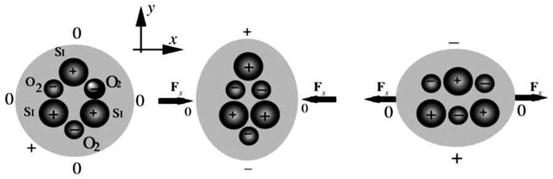
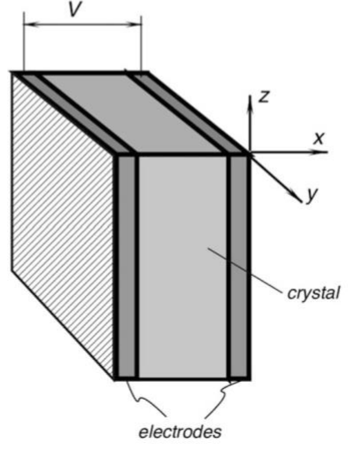
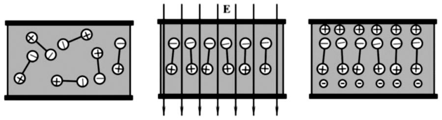
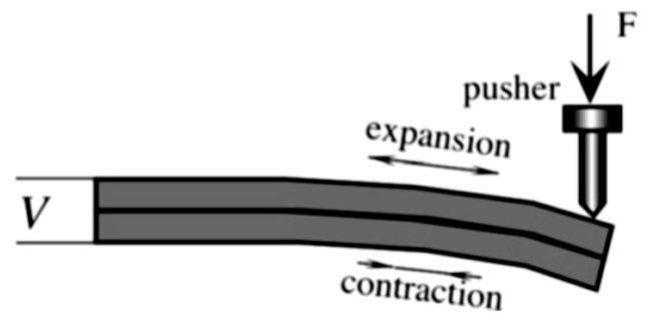
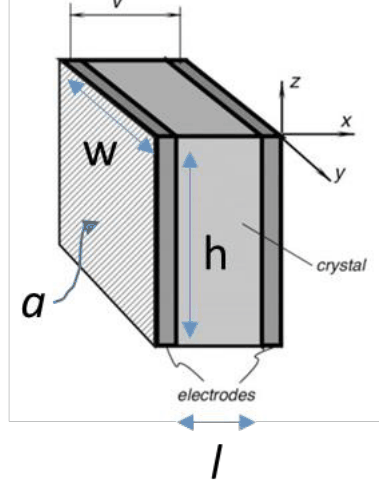
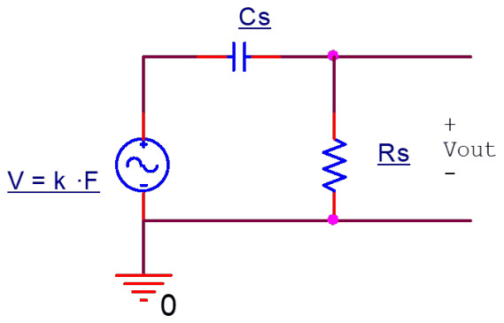
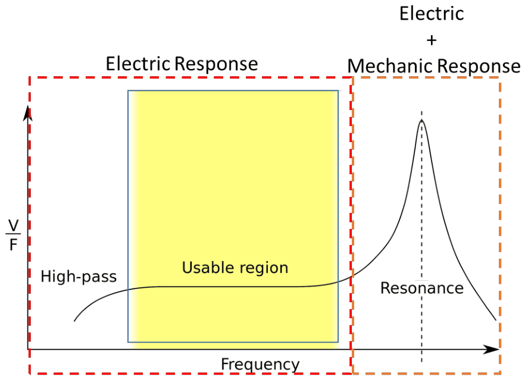
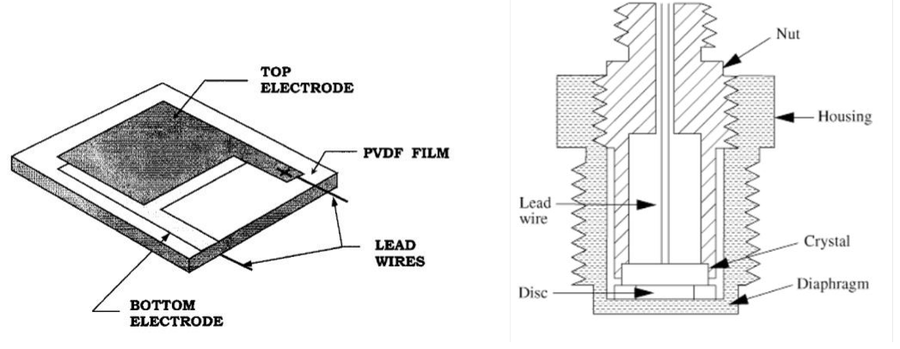
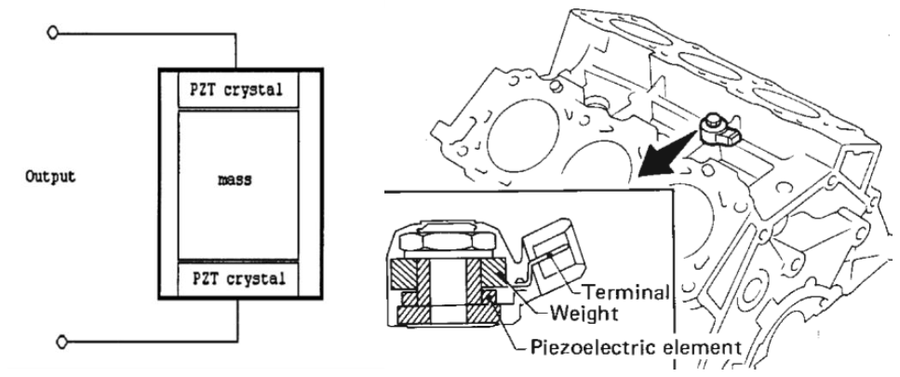

# Sensors piezoelèctrics: efecte, materials, model elèctric i resposta

## 📑 Índice de Contenidos

- [1 L'efecte piezoelèctric](#1-lefecte-piezoelèctric)
- [2 Coeficients piezoelèctrics de càrrega](#2-coeficients-piezoelèctrics-de-càrrega)
- [3 Fabricació i compensació tèrmica](#3-fabricació-i-compensació-tèrmica)
- [4 Materials](#4-materials)
- [5 Model elèctric](#5-model-elèctric)
- [6 Resposta freqüencial](#6-resposta-freqüencial)
- [7 Aplicacions](#7-aplicacions)

---

Sistemes de Mesura · **Unitat 9 — Sensors generadors i unions semiconductores** · Document 4 de 6

# Sensors piezoelèctrics: efecte, materials, model elèctric i resposta

Dedicació estimada: 14 minuts

> [!NOTE] **Objectius d'aprenentatge**
>
> - Relacionar l'efecte piezoelèctric amb la simetria de l'estructura cristal·lina del material.
> - Interpretar els índexs dels coeficients piezoelèctrics de càrrega i les seves unitats.
> - Escriure la càrrega i la tensió generades per una força i identificar de quins paràmetres geomètrics depenen.
> - Triar el material piezoelèctric a partir de la sensibilitat en càrrega o en tensió que demana l'aplicació.
> - Determinar la banda útil del sensor a partir de la freqüència de tall inferior i de la ressonància mecànica.

## 1 L'efecte piezoelèctric

Descobert pels germans Pierre i Jacques Curie el 1880, l'efecte piezoelèctric consisteix que, en certs materials dielèctrics, una tensió mecànica que els deforma provoca l'aparició d'un camp elèctric en circuit obert o, equivalentment, d'una densitat de corrent en curtcircuit. La deformació modifica la distribució de càrregues del cristall i apareix una càrrega neta superficial proporcional a la deformació.

*Figura: Figura 9.15 Efecte piezoelèctric en el quars.*

El fenomen està lligat a la simetria de l'estructura cristal·lina. En un cristall centrosimètric els centres de càrrega positiva i negativa coincideixen a cada cel·la unitat, el moment dipolar net és nul i qualsevol deformació preserva la neutralitat elèctrica macroscòpica. En un cristall sense centre de simetria, en canvi, els centres de càrrega es poden desplaçar l'un respecte de l'altre sota l'acció d'una tensió mecànica i apareix un moment dipolar net a la cel·la.

| Classes | Propietat |
|:--- |:--- |
| **32** | Classes cristal·lines possibles. |
| **20** | Poden presentar efecte piezoelèctric: no tenen centre de simetria. |
| **10** | Presenten a més polarització espontània dependent de la temperatura: són piroelèctriques. |

El quars, SiO₂, té una estructura trigonal sense centre de simetria; en aplicar-hi una força al llarg d'un eix, els ions Si⁴⁺ i O²⁻ es desplacen i apareix un moment dipolar net, amb la polarització en un eix ortogonal al de la força aplicada. L'orientació del tall cristal·lí determina, doncs, la sensibilitat i l'estabilitat del sensor. Els materials policristal·lins sense tractament no mostren piezoelectricitat macroscòpica perquè les contribucions dels dominis es cancel·len en mitjana; per això els comercials són monocristalls, com el quars, o ceràmics tractats per orientar-ne els dominis, com el PZT.

A escala macroscòpica el comportament es recull en el vector de polarització  $\vec{P}$, moment dipolar per unitat de volum. En repòs pot ser nul, en materials paraelèctrics en equilibri, o tenir un valor residual anomenat **polarització espontània**, en els materials ferroelèctrics.

| Mode | Descripció i ús |
|:--- |:--- |
| **Efecte directe** (sensor) | Una força o tensió mecànica genera càrrega i una tensió mesurable als terminals. És el mode d'operació com a sensor de força, pressió, acceleració o impacte. |
| **Efecte invers** (actuador) | Una tensió elèctrica entre els elèctrodes provoca una deformació mecànica, governada pels mateixos coeficients. Posicionadors de precisió, emissors d'ultrasons i altaveus piezoelèctrics. |

Un mateix element s'utilitza sovint alternativament en mode emissor i en mode receptor, com en el transductor d'un sonar o d'una sonda d'ultrasons, que emet un pols excitant el material com a actuador i poc després en rep el ressò com a sensor.

## 2 Coeficients piezoelèctrics de càrrega

La tensió mecànica aplicada al material és un tensor amb sis components independents: tres normals  $(\sigma_x, \sigma_y, \sigma_z)$  i tres de cisalla o torsió  $(\tau_{\text{yz}}, \tau_{\text{xz}}, \tau_{\text{xy}})$, numerades amb índexs d'1 a 6. Cada component de la polarització hi respon amb una combinació lineal:

$$
P_i = \sum_j d_{\text{ij}}\,\sigma_j \qquad (9.8)
$$

*Figura: Figura 9.16 Sensor piezoelèctric i definició dels eixos.*

> [!WARNING] **Coeficient piezoelèctric de càrrega $d_{\text{ij}}$**
>
> Relació entre la densitat de càrrega superficial que apareix a la cara perpendicular a l'eix  $i$  i la tensió mecànica aplicada al llarg de l'eix  $j$. L'índex  $i \in \{1{,}2,3\}$  és la direcció de la polarització generada i  $j \in \{1,\dots,6\}$  la de la tensió mecànica, torsions incloses: el tensor és de  $3 \times 6$. Unitats: C/N, o equivalentment m/V des del punt de vista de l'efecte invers.

Segons com es talli el material, les components dominants de  $d_{\text{ij}}$  són diferents, i també ho és la sensibilitat a força normal o a torsió. En els ceràmics fabricats per *poling* s'escullen orientacions concretes dels elèctrodes respecte del camp de polarització per maximitzar  $d_{33}$  o  $d_{31}$. Els valors tabulats depenen del material, del tall i del procés de fabricació.

## 3 Fabricació i compensació tèrmica

Els millors materials pel que fa a sensibilitat són ceràmics policristal·lins com el PZT, que en estat natural no mostren piezoelectricitat macroscòpica perquè els seus dominis ferroelèctrics estan orientats aleatòriament. El procés de **poling** els hi dona: es calenta el material fins a les proximitats del punt de Curie, s'hi aplica un camp elèctric molt intens que orienta els dipols en una direcció preferent i, mantenint el camp, es refreda lentament, de manera que l'alineament queda congelat. El material preserva llavors la polarització i respon amb càrrega quan es deforma.

*Figura: Figura 9.17 Fabricació de material piezoelèctric mitjançant poling.*

Un canvi posterior de les condicions d'operació —temperatura, camp elèctric elevat, tensió mecànica extrema— pot despolaritzar parcialment el material i degradar-ne el rendiment.

> [!WARNING] **Temperatura de Curie $T_c$**
>
> Per sobre de  $T_c$  l'agitació tèrmica destrueix l'ordenació ferroelèctrica dels dipols i el material perd irreversiblement la polarització: encara que després es refredi, cal tornar a polaritzar-lo, cosa que sovint no és factible en un sensor ja encapsulat. Valors típics: uns 300 °C per al PZT, uns 100 °C per al PVDF i per damunt de 500 °C per al quars. Els fabricants recomanen temperatures de treball al voltant de  $T_c/2$  o inferiors per minimitzar la degradació lenta de les propietats.

Tant  $d_{\text{ij}}$  com  $\varepsilon_r$  creixen monòtonament amb la temperatura fins a les proximitats de  $T_c$, on tenen un increment brusc abans de col·lapsar. Com que la tensió generada depèn del quocient  $d_{\text{ij}}/\varepsilon_r$, tots dos factors creixen en el mateix sentit i la compensació és parcial; el quocient, però, no es manté rigorosament constant, de manera que les mesures precises de força exigeixen controlar o monitoritzar la temperatura del material. En alta precisió el sensor incorpora una sonda de temperatura interna i el circuit digital hi corregeix la mesura.

*Figura: Figura 9.18 Estructura bicapa per a la compensació de la deriva amb la temperatura.*

Una estratègia habitual és construir el sensor amb diverses capes separades per elèctrodes i connectades en sèrie o en paral·lel. Orientades de manera que es deformin en sentit oposat sota la força mecànica però vegin els canvis de temperatura en el mateix sentit, la contribució tèrmica es resta entre capes mentre que la mecànica se suma. S'empra en acceleròmetres i en sensors de flexió. Altres configuracions apilen multicapes primes en paral·lel per augmentar la capacitat i reduir la impedància de sortida, a canvi d'una tensió generada més petita per a la mateixa força.

## 4 Materials

| Família | Representants | Perfil |
|:--- |:--- |:--- |
| **Naturals** | Quars (SiO₂), turmalina, sal de Rochelle | Piezoelèctrics per estructura, sense processat. Coeficients de càrrega baixos, però estabilitat tèrmica i mecànica excel·lent i constants dielèctriques reduïdes. El quars s'usa en oscil·ladors, ressonadors i sensors d'alta estabilitat; la sal de Rochelle té coeficients molt grans però és soluble en aigua. |
| **Ceràmics** | PZT, BaTiO₃, TGS, niobats de sodi i potassi | Compostos inorgànics sintetitzats per exhibir piezoelectricitat després del *poling*. Coeficients de càrrega molt alts i constants dielèctriques també altes. El PZT és la referència en acceleròmetres industrials, transductors d'ultrasons, microposicionadors i hidròfons; la presència de plom ha motivat la recerca en alternatives sense plom. |
| **Orgànics** | PVDF | Polímers processats amb procediments anàlegs als dels ceràmics. Coeficients modestos, però elasticitat elevada, constant dielèctrica molt inferior a la dels ceràmics i mal·leabilitat: làmines primes, formes complexes, grans àrees. Micròfons, sensors de contacte, hidròfons i pel·lícules per a robòtica, amb  $T_c$  de l'ordre de 100 °C. |

| Material | $d_{\text{ij}}$  (pC/N) | $\varepsilon_r$ | Tipus | Característica distintiva |
|:--- |:--- |:--- |:--- |:--- |
| Quars | ≈ 2 | 4,5 | Natural | Estabilitat extrema, baixa sensibilitat |
| BaTiO₃ | ≈ 190 | 1700 | Ceràmic | Pioner, baix cost |
| PZT | 100–600 | 1000–3000 | Ceràmic | Sensibilitat molt alta |
| PVDF | 20–30 | 12 | Orgànic | Flexibilitat,  $d/\varepsilon_r$  alt |
| TGS | variable | ≈ 50 | Ceràmic | Piroelèctric molt utilitzat |

| Objectiu | Material |
|:--- |:--- |
| Màxima sensibilitat en tensió (V/N): interessa  $d/\varepsilon_r$  gran | PVDF |
| Màxima sensibilitat en càrrega (C/N) amb amplificador de càrrega: interessa  $d$  gran | PZT |
| Màxima estabilitat tèrmica i a llarg termini | Quars |
| Sensors flexibles, de gran àrea o de forma complexa | PVDF |
| Actuadors amb desplaçaments importants | PZT |

## 5 Model elèctric

El sensor és una làmina de dielèctric piezoelèctric amb dos elèctrodes metàl·lics dipositats sobre cares oposades: geomètricament, un condensador pla el dielèctric del qual genera càrrega neta a les superfícies quan es deforma. Amb una força  $F$  aplicada en la direcció  $z$  i els elèctrodes perpendiculars a l'eix  $x$, la càrrega que hi apareix és

$$
Q_x = P_x A_x = d_{\text{xz}}\,\sigma_z\,A_x = d_{\text{xz}}\,\frac{F}{A_z}\,A_x \qquad (9.9)
$$

*Figura: Figura 9.19 Càlcul de la tensió desenvolupada per un sensor piezoelèctric en aplicar-hi una força.*

on  $A_x = a$  és l'àrea dels elèctrodes i  $A_z = l\,w$  la secció sobre la qual s'aplica la força, amb  $l$  el gruix entre elèctrodes i  $w$  l'amplada. La tensió en bornes és la càrrega dividida per la capacitat,

$$
V = \frac{Q_x}{C}, \qquad C = \varepsilon_0 \varepsilon_r \frac{A_x}{l} \qquad (9.10)
$$

amb  $\varepsilon_r$  la permitivitat relativa del material i  $l$  la separació entre elèctrodes, és a dir el gruix. Substituint-hi la càrrega i la capacitat,

$$
V = \frac{d_{\text{xz}}\,F\,l}{\varepsilon_0 \varepsilon_r A_z} \qquad (9.11)
$$

i, com que  $A_z = l\,w$,

$$
V = \frac{d_{\text{xz}}\,F}{\varepsilon_0 \varepsilon_r\, w} \qquad (9.12)
$$

de manera que la tensió generada depèn només d'una dimensió lateral del material. Si els elèctrodes es curtcircuiten, la càrrega flueix d'una placa a l'altra i el corrent és proporcional a la *variació* de la força,  $i(t) = d_{\text{xz}}\,\frac{\mathrm{d}F}{\mathrm{d}t}$.

El model es completa amb una **resistència de fuita**  $R_s$  en paral·lel amb el condensador, associada a la conductivitat residual del dielèctric, habitualment de gigaohms a teraohms: la càrrega generada acaba descarregant-s'hi. Les capacitats típiques van de pocs pF, en sensors petits o de quars, a algunes desenes de nF, en sensors grans de materials d'alta constant dielèctrica com el PZT. La combinació dona una impedància molt elevada a baixa freqüència, i en particular a la freqüència de la xarxa, amb els problemes d'acoblament capacitiu amb l'entorn que això comporta.

## 6 Resposta freqüencial

*Figura: Figura 9.20 Model elèctric simplificat d'un sensor piezoelèctric.*

Amb una font de tensió  $V = k\,F$  en sèrie amb la capacitat  $C_s$  del material i  $R_s$  en paral·lel amb el conjunt, la resposta entre la força aplicada i la tensió de sortida és

$$
\frac{V_\mathrm{out}(j\omega)}{F(j\omega)} = k \cdot \frac{j\omega R_s C_s}{1 + j\omega R_s C_s} \qquad (9.13)
$$

que és un filtre passa-alt de primer ordre amb freqüència de tall

$$
f_{-3\mathrm{dB}} = \frac{1}{2\pi R_s C_s} \qquad (9.14)
$$

El comportament passa-alt té una explicació física directa: amb una força constant, la càrrega generada inicialment es redistribueix a través de  $R_s$  fins que la tensió en bornes s'extingeix. El sensor piezoelèctric és intrínsecament dinàmic i no mesura forces estàtiques.

Quan el sensor es connecta a un circuit de mesura d'impedància d'entrada  $Z_\mathrm{in}$, aquesta queda en paral·lel amb  $R_s$  i la resistència equivalent és  $R_\mathrm{eq} = R_s \parallel Z_\mathrm{in}$, en general més petita que  $R_s$, de manera que la freqüència de tall puja:

$$
f'_{-3\mathrm{dB}} = \frac{1}{2\pi R_\mathrm{eq} C_s} \qquad (9.15)
$$

| Circuit de lectura | Freqüència de tall inferior |
|:--- |:--- |
| Cap: només  $R_s$ | ≈ 16 mHz |
| Oscil·loscopi amb  $Z_\mathrm{in} = 1$  MΩ | ≈ 160 Hz |

Una impedància d'entrada d'1 MΩ desplaça el tall inferior per damunt de 100 Hz. D'aquí que els sensors piezoelèctrics exigeixin circuits de condicionament d'impedància d'entrada extremament alta, anomenats amplificadors electromètrics, o bé amplificadors de càrrega, que mesuren la càrrega transferida en lloc de la tensió. Tots dos es tracten a la unitat 10.

*Figura: Figura 9.21 Resposta freqüencial d'un sensor piezoelèctric.*

Per l'extrem superior, l'elasticitat i la inèrcia del material introdueixen modes de ressonància mecànica. A la freqüència de ressonància  $f_r$  la deformació per a una força donada és màxima, i també ho és la tensió generada; per damunt, la resposta deixa de ser plana i apareixen pics de sensibilitat amb canvis de fase importants. Com a sensor, la norma és treballar molt per sota de  $f_r$, típicament a menys d' $f_r/5$. Com a actuador, en canvi, la ressonància s'explota: excitar el dispositiu a  $f_r$  dona la màxima deformació per a una excitació elèctrica donada, cosa que interessa en emissors d'ultrasò.

## 7 Aplicacions

*Figura: Figura 9.22 Sensors piezoelèctrics per a la mesura de força i de pressió.*

En la mesura de força o pressió dinàmiques el sensor es col·loca en sèrie amb la línia de força, de manera que tota la força es transmet a través del material: cèl·lules de càrrega dinàmiques de bancs d'assaig, sensors de pressió dins de motors de combustió, sensors de força en robòtica i sensors de tacte. Per a mesures quasi-estàtiques es recorre a amplificadors de càrrega amb constants de temps de desenes de segons.

*Figura: Figura 9.23 Sensors piezoelèctrics per a la mesura d'acceleració i de vibracions.*

Els acceleròmetres piezoelèctrics són l'aplicació industrial més important. Una massa inercial en contacte amb l'element piezoelèctric hi exerceix una força  $F = m\,a$  quan el sensor s'accelera, de manera que la càrrega generada és proporcional a l'acceleració. La rapidesa de resposta, el rang dinàmic —fins a milers de *g*— i la sensibilitat els fan la base de la monitorització de vibracions de màquines rotatives, motors, compressors i turbines, i s'empren també en sensors d'impacte per al desplegament d'*airbags*, en seguretat sísmica i en botons d'activació per pressió.

L'efecte invers dona lloc a les aplicacions com a actuador: transductors d'ultrasons per a ecografia, sonar, neteja ultrasònica i soldadura; microposicionadors per a microscopis d'efecte túnel i de força atòmica; injectors de motors dièsel, i altaveus miniatura.

| Problema | Origen i mitigació |
|:--- |:--- |
| **Càrrega** | La impedància d'entrada del circuit de mesura retalla la banda baixa. Amplificadors electromètrics o amplificadors de càrrega. |
| **Interferències** | Qualsevol capacitat paràsita entre el sensor i l'entorn acobla la xarxa elèctrica o altres fonts d'EMI a l'entrada de l'amplificador. Apantallament triaxial amb pantalla connectada a guarda, cables curts, amplificador al costat del sensor o integrat dins del mateix encapsulat. |

> [!TIP] **Síntesi**
>
> La piezoelectricitat apareix en les 20 classes cristal·lines sense centre de simetria, i el coeficient  $d_{\text{ij}}$  relaciona la densitat de càrrega sobre la cara perpendicular a l'eix  $i$  amb la tensió mecànica al llarg de l'eix  $j$, en C/N. El sensor és un condensador amb dielèctric actiu: la càrrega val  $Q = d\,F$  i la tensió  $V = d\,F/(\varepsilon_0\varepsilon_r w)$. El *poling* dona resposta macroscòpica als ceràmics i la temperatura de Curie en marca el límit irreversible; les estructures multicapa cancel·len la deriva tèrmica. El PZT maximitza la sensibilitat en càrrega, el PVDF la sensibilitat en tensió gràcies al seu  $d/\varepsilon_r$, i el quars l'estabilitat. La resposta és passa-alt amb tall  $\frac{1}{2\pi R_\mathrm{eq}C_s}$, de manera que el sensor no mesura forces estàtiques i la impedància d'entrada del circuit determina la banda baixa; per dalt, la banda útil acaba molt per sota de la ressonància mecànica.

[← 3. Lleis termoelèctriques, compensació de la unió freda i prestacions](03_Unitat9_Lleis_unio_freda_i_prestacions.md)[5. Sensors piroelèctrics: polarització espontània, dinàmica i detecció d'infraroig →](05_Unitat9_Sensors_piroelectrics.md)

---

## 📐 Formulario Resumen de Ecuaciones

| Nº / Ref | Expresión Matemática |
| :---: | :--- |
| **(9.8)** | $P_i = \sum_j d_{\text{ij}}\,\sigma_j$ |
| **(9.9)** | $Q_x = P_x A_x = d_{\text{xz}}\,\sigma_z\,A_x = d_{\text{xz}}\,\frac{F}{A_z}\,A_x$ |
| **(9.10)** | $V = \frac{Q_x}{C}, \qquad C = \varepsilon_0 \varepsilon_r \frac{A_x}{l}$ |
| **(9.11)** | $V = \frac{d_{\text{xz}}\,F\,l}{\varepsilon_0 \varepsilon_r A_z}$ |
| **(9.12)** | $V = \frac{d_{\text{xz}}\,F}{\varepsilon_0 \varepsilon_r\, w}$ |
| **(9.13)** | $\frac{V_\mathrm{out}(j\omega)}{F(j\omega)} = k \cdot \frac{j\omega R_s C_s}{1 + j\omega R_s C_s}$ |
| **(9.14)** | $f_{-3\mathrm{dB}} = \frac{1}{2\pi R_s C_s}$ |
| **(9.15)** | $f'_{-3\mathrm{dB}} = \frac{1}{2\pi R_\mathrm{eq} C_s}$ |