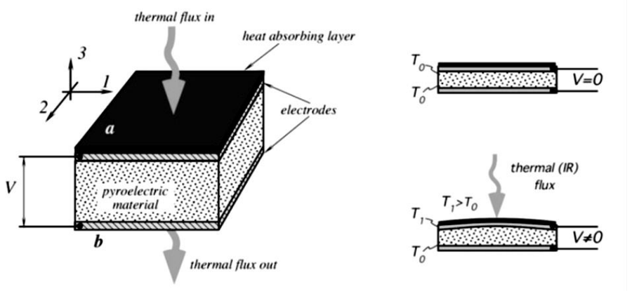
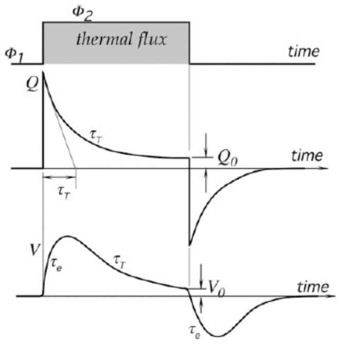
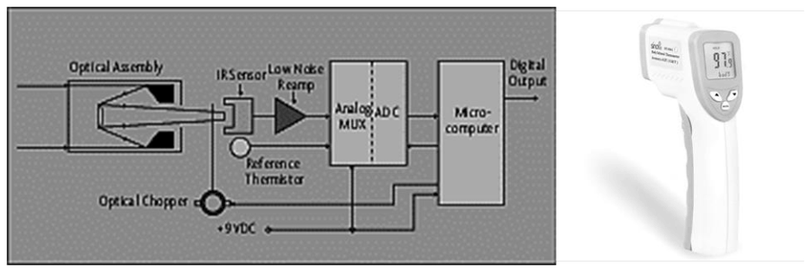
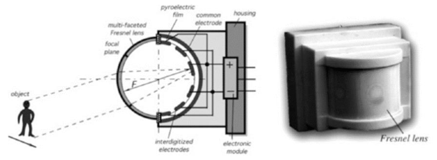

# Sensors piroelèctrics: polarització espontània, dinàmica i detecció d'infraroig

## 📑 Índice de Contenidos

- [1 Polarització espontània i efecte piroelèctric](#1-polarització-espontània-i-efecte-piroelèctric)
- [2 Estructura del sensor](#2-estructura-del-sensor)
- [3 Coeficients piroelèctrics](#3-coeficients-piroelèctrics)
- [4 Resposta dinàmica](#4-resposta-dinàmica)
- [5 Detecció d'infraroig i detectors PIR](#5-detecció-dinfraroig-i-detectors-pir)

---

Sistemes de Mesura · **Unitat 9 — Sensors generadors i unions semiconductores** · Document 5 de 6

# Sensors piroelèctrics: polarització espontània, dinàmica i detecció d'infraroig

Dedicació estimada: 13 minuts

> [!NOTE] **Objectius d'aprenentatge**
>
> - Situar la piroelectricitat respecte de la piezoelectricitat en termes de simetria cristal·lina i de magnitud mesurada.
> - Justificar per què el sensor no dona senyal en règim estacionari.
> - Emprar els coeficients piroelèctrics de càrrega i de tensió per estimar la càrrega i la tensió generades.
> - Interpretar la resposta a un pols de radiació a partir de les constants de temps tèrmica i elèctrica.
> - Explicar com un detector PIR modula el flux tèrmic i quines limitacions pràctiques comporta.

## 1 Polarització espontània i efecte piroelèctric

Els sensors piroelèctrics comparteixen materials, estructura i bona part del model circuital amb els piezoelèctrics, però responen al **flux de calor** que travessa el material: aprofiten la variació de la polarització espontània quan el material canvia de temperatura.

De les 32 classes de simetria cristal·lina, 20 mostren efecte piezoelèctric per manca de centre de simetria, i d'aquestes només 10 presenten a més polarització espontània dependent de la temperatura. Tot material piroelèctric és, doncs, piezoelèctric; el recíproc no és cert.

|  | Material piezoelèctric | Material piroelèctric |
|:--- |:--- |:--- |
| **Estat en repòs** | Sense polarització neta, o amb polarització romanent que no dona senyal. | Polarització espontània  $P_s$  present ja en repòs. |
| **Origen del senyal** | La deformació mecànica canvia la polarització. | El canvi de temperatura canvia  $P_s$. |
| **Sense excitació** | Sense deformació no apareix càrrega neta. | A temperatura constant la polarització és constant i la conductivitat del dielèctric compensa la càrrega. |

Formalment, un material piroelèctric és un dielèctric amb polarització espontània en absència de camp elèctric extern i amb

$$
P_s = P_s(T), \qquad \frac{dP_s}{dT} \neq 0 \qquad (9.16)
$$

*Figura: Figura 9.24 Efecte piroelèctric.*

A temperatura constant, la càrrega de polarització que apareixeria a les superfícies queda neutralitzada per càrregues lliures del propi dielèctric o de l'aire circumdant, i el sistema arriba a un estat estacionari sense senyal útil. Quan la temperatura canvia, la polarització canvia i les càrregues lliures no tenen temps d'equilibrar-ne la variació: apareix una càrrega neta superficial que es manifesta com un corrent pel circuit extern o com una tensió en bornes.

El sensor respon, doncs, al *canvi* de temperatura i no a la temperatura absoluta. Un cos calent immòbil davant del sensor deixa de produir senyal al cap de poca estona, i és precisament aquest comportament el que fa útils els detectors PIR per detectar moviment o l'aparició sobtada de cossos calents.

## 2 Estructura del sensor

L'estructura és la mateixa que la d'un sensor piezoelèctric: una làmina de material amb dos elèctrodes metàl·lics sobre cares oposades, que formen un condensador pla. Una cara s'orienta a rebre la radiació o el flux tèrmic i l'altra queda en contacte amb un dissipador o amb el substrat. La cara frontal es recobreix amb una capa absorbent d'alta emissivitat que maximitza l'absorció de la radiació incident i la seva conversió en energia tèrmica; mentre hi hagi diferència de temperatura entre les dues cares, la polarització canvia i apareix senyal.

Elèctricament és un condensador de capacitat  $C$  amb una resistència de fuita  $R$  deguda a la conductivitat del dielèctric, alimentat per una font de càrrega que lliura  $Q$  en funció del canvi de temperatura. Les tècniques de condicionament són, per tant, les mateixes: amplificadors electromètrics o amplificadors de càrrega.

Com que tot material piroelèctric és també piezoelèctric, qualsevol tensió mecànica aplicada al sensor hi genera càrrega d'origen piezoelèctric superposada a la d'origen piroelèctric, i si apareix a freqüències comparables a les del senyal útil, degrada la relació senyal-soroll i provoca falsos positius. El disseny ho evita amb un muntatge mecànicament desacoblat: el material es fixa al suport per zones molt petites de la perifèria a través d'elements flexibles, i l'encapsulat incorpora materials absorbidors de vibracions.

> [!WARNING] **Configuració diferencial de dues cel·les**
>
> Molts sensors comercials porten dues cel·les connectades en oposició, una exposada a la radiació i l'altra cega. Totes dues reben les mateixes vibracions mecàniques i els mateixos canvis de temperatura ambient, de manera que aquestes contribucions es cancel·len, mentre que una radiació direccional que només incideix sobre una de les cel·les hi genera un senyal net.

Els materials són en bona part els dels sensors piezoelèctrics —PZT, PVDF, TGS—, als quals s'afegeixen el tantalat de liti (LiTaO₃), molt utilitzat en detectors PIR comercials, i el niobat de liti (LiNbO₃), en sensors d'alta precisió i espectroscòpia. Els monocristalls com el LiTaO₃ tenen coeficients moderats però molt estables; alguns ceràmics arriben a coeficients més alts amb més deriva; el PVDF aporta flexibilitat i sensors grans i barats.

## 3 Coeficients piroelèctrics

El **coeficient piroelèctric de càrrega**  $p_q$  és la variació de la polarització espontània per unitat de canvi de temperatura:

$$
p_q = \frac{dP_s}{dT} = \frac{1}{A}\frac{dQ}{dT} \qquad (9.17)
$$

amb  $A$  la superfície del sensor. Les seves unitats són C/(m²·K), i es tabula habitualment en μC/(m²·K): indica quanta càrrega apareix per unitat d'àrea i per unitat de canvi de temperatura. Els valors van de pocs μC/(m²·K) per al PVDF a desenes o centenars per a materials com el TGS o el LiTaO₃. És el paràmetre que els fabricants destaquen als fulls de característiques, perquè la sensibilitat en càrrega hi és directament proporcional.

El **coeficient piroelèctric de tensió**  $p_v$  relaciona el camp elèctric generat amb el canvi de temperatura:

$$
p_v = \frac{1}{h}\frac{dV}{dT} = \frac{dE}{dT} \qquad (9.18)
$$

amb  $h$  el gruix del sensor, en V/(m·K). Tots dos coeficients estan lligats per la capacitat del sensor:

$$
p_v = \frac{p_q}{\varepsilon_0 \varepsilon_r} \qquad (9.19)
$$

de manera que, per a un mateix  $p_q$, un material de constant dielèctrica més petita, com el PVDF, dona més tensió per unitat de canvi de temperatura. La càrrega i la tensió generades davant d'un canvi de temperatura  $\Delta T$  són

$$
\Delta Q = p_q A\,\Delta T, \qquad \Delta V = p_v h\,\Delta T = \frac{p_q h\,\Delta T}{\varepsilon_0 \varepsilon_r} \qquad (9.20)
$$

i la capacitat s'estima, com en el cas piezoelèctric, a partir de la geometria —àrea dels elèctrodes i gruix de la làmina— i de la permitivitat relativa del material:

$$
C = \frac{\varepsilon_0 \varepsilon_r A}{h} \qquad (9.21)
$$

| Magnitud | Valor |
|:--- |:--- |
| Canvi de temperatura  $\Delta T$ | 0,01 °C |
| Càrrega generada  $\Delta Q$ | ≈ 2,3 pC |
| Tensió generada, amb  $h = 100$  μm i  $\varepsilon_r \approx 40$ | ≈ 650 mV |

Per als materials i les geometries dels detectors comercials les capacitats van de pocs pF a centenars de pF i, amb resistències de fuita de GΩ o TΩ, donen impedàncies de sortida molt elevades. Per això molts sensors integren dins del mateix encapsulat un FET seguidor que rep la càrrega del cristall i n'abaixa la impedància de sortida a un valor manejable.

El coeficient  $p_q$  creix monòtonament amb la temperatura i puja de manera abrupta prop de la temperatura de Curie, on la polarització espontània desapareix i l'efecte piroelèctric es perd. Treballar a prop de  $T_c$  dona sensibilitats elevades amb penalització en estabilitat, perquè petites variacions de temperatura ambient canvien significativament el coeficient; d'aquí que els sensors s'utilitzin força per sota de  $T_c$, i que en aplicacions científiques es mantinguin a temperatura fixa.

## 4 Resposta dinàmica

Davant d'un flux de calor  $\Phi$  constant a partir de  $t = 0$, el material s'escalfa fins a una temperatura més alta i, en règim estacionari, tota la calor absorbida flueix cap a l'entorn per la cara posterior: la polarització espontània torna a ser constant, encara que a un altre valor, i la càrrega generada és zero. El senyal apareix només durant el transitori, amb una constant de temps tèrmica

$$
\tau_T = R_T C_T = R_T\,c\,\rho\,A\,h \qquad (9.22)
$$

on  $R_T$  és la resistència tèrmica efectiva cap a l'entorn,  $c$  la calor específica,  $\rho$  la densitat i  $A\,h$  el volum del sensor. La càrrega generada es reparteix alhora entre la capacitat elèctrica i la resistència equivalent que veu el sensor —el paral·lel de la resistència del dielèctric amb la impedància d'entrada del circuit—, amb una constant de temps elèctrica

$$
\tau_E = R\,C \qquad (9.23)
$$

*Figura: Figura 9.25 Resposta dinàmica d'un sensor piroelèctric davant d'un pols de radiació.*

La tensió observable combina les dues dinàmiques:

$$
V(t) = V_0\left(e^{-t/\tau_E} - e^{-t/\tau_T}\right) \qquad (9.24)
$$

amb  $V_0$  funció del flux tèrmic, del coeficient piroelèctric, de la capacitat i de les dues constants de temps. El resultat és un pols amb una pujada determinada per la més petita de les dues constants i una caiguda determinada per la més gran. Els valors típics són  $\tau_T$  de fraccions de segon a segons i  $\tau_E$  de mil·lisegons a desenes de segons, segons el circuit de mesura.

La tensió de sortida és màxima en els instants en què el flux tèrmic canvia. Per maximitzar la sensibilitat davant d'una font de radiació constant, doncs, cal modular la radiació incident a una freqüència dins de la banda útil del sensor: és la tècnica coneguda com a ***chopping***.

La impedància d'entrada del circuit té aquí el mateix pes que en els sensors piezoelèctrics: si val 1 MΩ, és ella qui domina el paral·lel i fixa  $\tau_E$. Preservar la dinàmica natural a baixa freqüència exigeix amplificadors electromètrics amb corrents de polarització de l'ordre de fA o menys, basats en JFET o MOSFET, sovint integrats dins del mateix encapsulat del sensor.

## 5 Detecció d'infraroig i detectors PIR

Qualsevol cos per damunt del zero absolut emet radiació electromagnètica; els cossos a temperatura ambient ho fan majoritàriament a l'infraroig llunyà, centrat al voltant de 10 μm. El sensor piroelèctric respon a l'energia tèrmica absorbida independentment de la longitud d'ona, de manera que la seva resposta espectral és molt àmplia: és sensible a qualsevol radiació que absorbeixi el seu recobriment, visible, infraroja o fins i tot microones. Els detectors quàntics, com els fotodíodes d'InGaAs o els de HgCdTe, tenen una resposta molt selectiva en longitud d'ona i perden tota sensibilitat fora del seu rang. Els piroelèctrics tampoc no requereixen refrigeració, a diferència d'alguns detectors quàntics que operen a temperatures criogèniques: el sistema és més simple i barat, al preu d'una sensibilitat menor.

*Figura: Figura 9.26 Termòmetre sense contacte basat en un sensor piroelèctric i un chopper mecànic.*

*Figura: Figura 9.27 Detector de presència piroelèctric amb lent de Fresnel.*

| Mètode | Funcionament i context |
|:--- |:--- |
| ***Chopper* mecànic** | Un disc rotatori amb zones opaques i transparents entre la font i el sensor fa arribar la radiació en polsos a una freqüència fixada per la velocitat de rotació. És la tècnica clàssica en termometria sense contacte, en espectroscòpia infraroja i en mesures científiques de radiació, i permet aplicar detecció síncrona a l'amplificació per detectar senyals molt febles submergits en soroll. |
| **Lent de Fresnel** | Divideix el camp de visió en múltiples sectors amb sensibilitat alternada. Un cos calent que es mou hi passa alternativament per zones sensibles i cegues, cosa que modula el flux tèrmic de manera natural. És el principi dels detectors de moviment de consum. |

El detector **PIR** (*Passive InfraRed*) allotja un sensor piroelèctric diferencial de dues cel·les dins d'un encapsulat metàl·lic amb una finestra òptica transparent a l'infraroig, i hi col·loca al davant la lent de Fresnel. El moviment d'una persona dins del camp de visió provoca un canvi sobtat de la radiació rebuda, que es tradueix en un pols elèctric i, després d'amplificar-lo i filtrar-lo, en una sortida digital. S'alimenta amb pocs volts, consumeix pocs mA i costa pocs euros, d'aquí el seu ús massiu en il·luminació automàtica, alarmes, obertura de portes i comptadors de persones.

| Limitació | Conseqüència |
|:--- |:--- |
| **No detecta cossos immòbils** | Una persona quieta dins del camp de visió deixa de generar senyal al cap de pocs segons: el sensor no serveix com a comptador de presència. |
| **Sensibilitat a canvis ambientals** | Obertures de finestres, fluxos d'aire calent, llum solar directa o objectes calents en moviment poden provocar falsos positius. |
| **Immunitat limitada a EMI** | El senyal és petit i d'alta impedància. L'encapsulat metàl·lic connectat a massa actua com a gàbia de Faraday. |

| Element | Criteri |
|:--- |:--- |
| **Finestra òptica** | Filtre que talla el visible i l'ultraviolat i deixa passar la banda d'interès, típicament de 7 a 14 μm per a cossos a temperatura ambient. |
| **Filtre elèctric** | Passa-banda centrat a les modulacions esperades, de 0,2 a 5 Hz per al moviment humà. Per sota s'eliminen les derives tèrmiques lentes; per damunt, el soroll i les interferències. |
| **Muntatge mecànic** | Desacoblament de vibracions, que d'altra manera s'acoblarien per l'efecte piezoelèctric del mateix material. |
| **Velocitat** | Amb una banda útil de pocs Hz no es poden mesurar fenòmens ràpids. L'espectroscòpia polsada empra sensors dissenyats amb constants de temps molt petites, amb la corresponent pèrdua de sensibilitat. |

> [!TIP] **Síntesi**
>
> Les 10 classes cristal·lines piroelèctriques tenen polarització espontània dependent de la temperatura; tot material piroelèctric és piezoelèctric, però no a l'inrevés. El senyal apareix quan la temperatura canvia: en règim estacionari la càrrega generada és zero. El coeficient de càrrega  $p_q = dP_s/dT$  dona  $\Delta Q = p_q A \Delta T$, i el de tensió  $p_v = p_q/(\varepsilon_0\varepsilon_r)$  afavoreix els materials de constant dielèctrica baixa. La resposta a un pols de radiació és la diferència de dues exponencials governades per  $\tau_T = R_T C_T$  i  $\tau_E = RC$, i la sortida és màxima quan el flux canvia, cosa que obliga a modular la radiació amb un *chopper* o amb una lent de Fresnel. El detector PIR combina una cel·la diferencial, una finestra de 7 a 14 μm i un passa-banda de 0,2 a 5 Hz, i no detecta cossos immòbils.

[← 4. Sensors piezoelèctrics: efecte, materials, model elèctric i resposta](04_Unitat9_Sensors_piezoelectrics.md)[6. Sensors de temperatura basats en unions semiconductores →](06_Unitat9_Sensors_de_temperatura_d_unio_semiconductora.md)

---

## 📐 Formulario Resumen de Ecuaciones

| Nº / Ref | Expresión Matemática |
| :---: | :--- |
| **(9.16)** | $P_s = P_s(T), \qquad \frac{dP_s}{dT} \neq 0$ |
| **(9.17)** | $p_q = \frac{dP_s}{dT} = \frac{1}{A}\frac{dQ}{dT}$ |
| **(9.18)** | $p_v = \frac{1}{h}\frac{dV}{dT} = \frac{dE}{dT}$ |
| **(9.19)** | $p_v = \frac{p_q}{\varepsilon_0 \varepsilon_r}$ |
| **(9.20)** | $\Delta Q = p_q A\,\Delta T, \qquad \Delta V = p_v h\,\Delta T = \frac{p_q h\,\Delta T}{\varepsilon_0 \varepsilon_r}$ |
| **(9.21)** | $C = \frac{\varepsilon_0 \varepsilon_r A}{h}$ |
| **(9.22)** | $\tau_T = R_T C_T = R_T\,c\,\rho\,A\,h$ |
| **(9.23)** | $\tau_E = R\,C$ |
| **(9.24)** | $V(t) = V_0\left(e^{-t/\tau_E} - e^{-t/\tau_T}\right)$ |