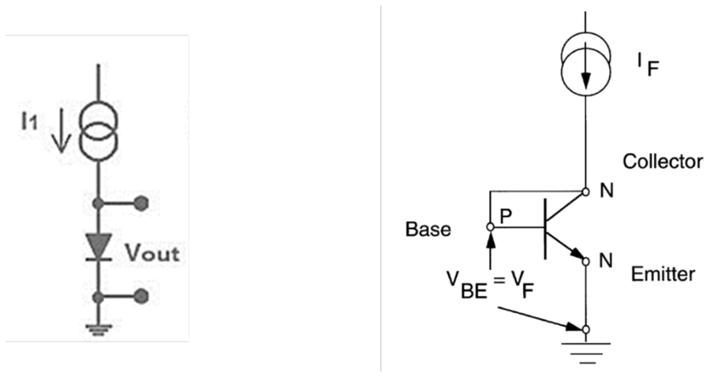
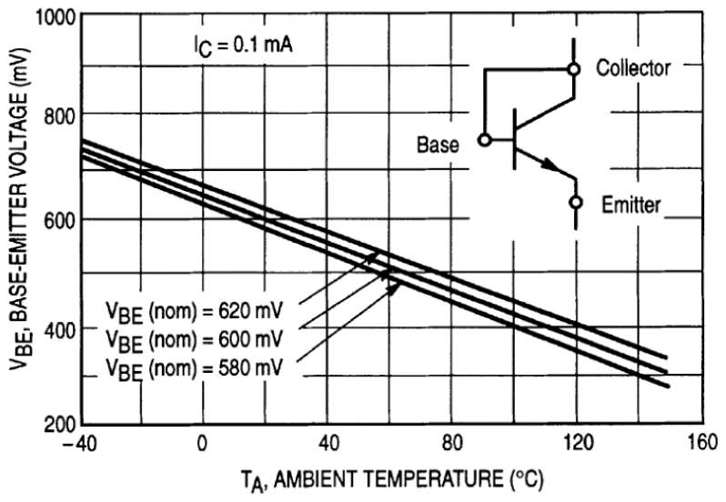
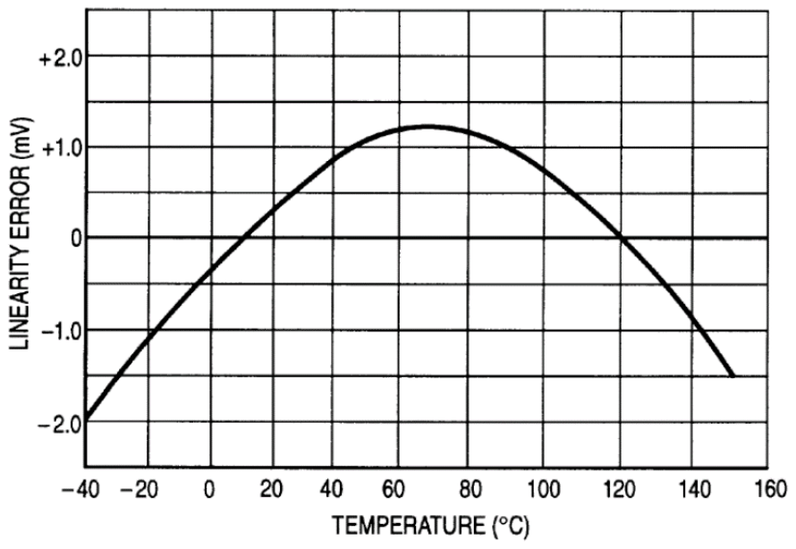
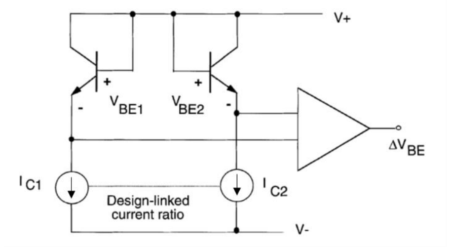
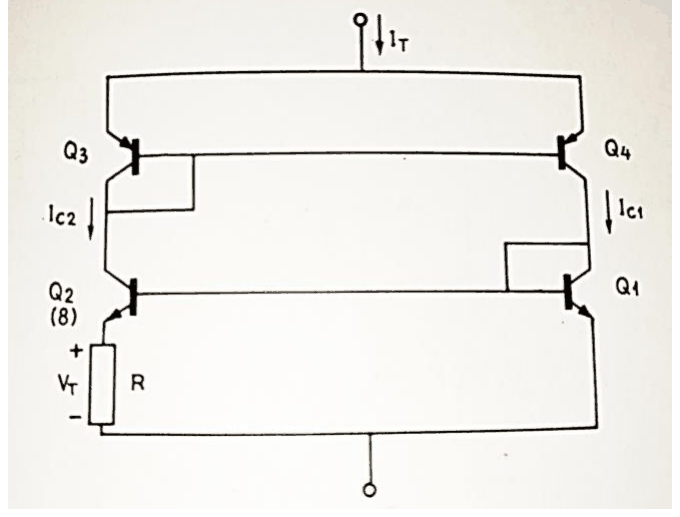

# Sensors de temperatura basats en unions semiconductores

## 📑 Índice de Contenidos

- [1 Posició dins de les famílies de sensors de temperatura](#1-posició-dins-de-les-famílies-de-sensors-de-temperatura)
- [2 La unió polaritzada a corrent constant](#2-la-unió-polaritzada-a-corrent-constant)
- [3 Limitacions i calibratge](#3-limitacions-i-calibratge)
- [4 Sensors PTAT amb sortida en corrent](#4-sensors-ptat-amb-sortida-en-corrent)
- [5 Prestacions](#5-prestacions)

---

Sistemes de Mesura · **Unitat 9 — Sensors generadors i unions semiconductores** · Document 6 de 6

# Sensors de temperatura basats en unions semiconductores

Dedicació estimada: 12 minuts

> [!NOTE] **Objectius d'aprenentatge**
>
> - Situar els sensors d'unió semiconductora davant de les RTD, els termistors i els termoparells.
> - Deduir de l'equació de Shockley per què la tensió directa d'una unió disminueix quan la temperatura augmenta.
> - Identificar l'origen de la dispersió entre dispositius i la manera de corregir-la.
> - Justificar per què la diferència de dues tensions base-emissor és proporcional a la temperatura absoluta.
> - Estimar l'autoescalfament d'un sensor i enumerar-ne les tècniques de mitigació.

Aquesta família necessita una excitació elèctrica en forma de corrent constant, però aprofita una propietat intrínseca del semiconductor —la dependència de la característica  $i$ – $v$  d'una unió  $p$ - $n$  amb la temperatura— i lliura directament una tensió o un corrent interpretables com a temperatura, sense ponts ni calibratges individuals en la majoria d'aplicacions. És, a més, la família més emprada per la compensació de la unió freda als termoparells.

## 1 Posició dins de les famílies de sensors de temperatura

| Família | Limitació en el context de l'electrònica integrada |
|:--- |:--- |
| **RTD** (unitat 5) | Excel·lent linealitat i exactitud, però exigeixen un bobinat metàl·lic voluminós o una pel·lícula prima amb procés propi, no integrable directament amb CMOS, i un condicionament amb excitació de corrent constant i amplificador d'alta qualitat. |
| **Termistors** (unitat 5) | Sensibilitat molt elevada i cost baix, però resposta fortament no lineal que obliga a taules o polinomis, i valor concret molt dependent del procés, que exigeix calibratge individual. |
| **Termoparells** | Marges de mesura enormes, però sensibilitat reduïda, amplificadors de baixa deriva i compensació de la unió freda. |

Els sensors d'unió semiconductora ocupen el marge de −55 °C a +150 °C, justament el de gairebé tota l'electrònica comercial, amb linealitat raonable, bona exactitud i integrabilitat total. Per damunt d'aquest marge la característica  $i$ – $v$  del material es degrada, i les aplicacions de forn, metal·lúrgia o combustió continuen essent territori dels termoparells.

| Avantatge | Motiu |
|:--- |:--- |
| **Cost** | Fabricació en processos estàndard de semiconductors. Un sensor independent pot costar pocs cèntims, i integrat en un microcontrolador o un SoC el cost marginal de silici és essencialment nul. |
| **Integrabilitat** | El sensor és un transistor bipolar o un díode, fabricable amb els mateixos processos CMOS, BiCMOS o bipolars que la resta del circuit. Permet posar sensors dins de microcontroladors, processadors, FPGA o amplificadors de potència i prendre decisions de control tèrmic en temps real. |
| **Intercanviabilitat** | Les dispersions dins d'un lot són petites i reproduïbles. En moltes aplicacions n'hi ha prou amb les especificacions del fabricant per a exactituds d'alguns graus, i un calibratge de dos punts dura tota la vida útil del sensor. |

Les aplicacions típiques són la monitorització tèrmica de circuits integrats, els termòmetres domèstics, industrials i mèdics, el control tèrmic de bateries, la climatització i la compensació de la unió freda dels termoparells.

## 2 La unió polaritzada a corrent constant

El sensor és una unió  $p$ - $n$  per la qual es fa circular un corrent constant i conegut, i el que es llegeix amb un circuit d'alta impedància és la tensió directa que hi cau.

| Dispositiu | Característiques |
|:--- |:--- |
| **Díode** | Aprofita directament la dependència de la tensió directa amb la temperatura. |
| **Transistor bipolar** | NPN amb col·lector i base curtcircuitats, elèctricament equivalent a un díode: la tensió entre els dos terminals és  $V_{\text{BE}}$. Característica  $i$ – $v$  més propera al model ideal, amb coeficient d'idealitat pròxim a 1 i menys efectes paràsits; fabricació més reproduïble; i admet configuracions de dos transistors que cancel·len  $I_S$. És l'opció dominant. |

*Figura: Figura 9.28 Sensors de temperatura d'unió semiconductora amb sortida en tensió.*

La font de corrent es pot implementar amb una resistència connectada a una alimentació ben regulada, amb un JFET autopolaritzat, amb un mirall de corrent o amb una font integrada. Una segona configuració connecta la base a una tensió de referència i aplica el corrent pel col·lector.

La corba  $i$ – $v$  ideal de la unió en conducció directa és l'equació de Shockley

$$
I = I_S(T)\left(e^{V_{\text{BE}}/V_T} - 1\right) \qquad (9.25)
$$

on  $V_T = kT/q$  és la tensió tèrmica, aproximadament 25,9 mV a 300 K, i  $I_S$  el corrent de saturació inversa, que depèn fortament de la temperatura a través d'una expressió del tipus  $I_S \propto T^3 e^{-E_g/(kT)}$, amb  $E_g$  l'energia de la banda prohibida. En polarització directa amb  $V_{\text{BE}} \gg V_T$  l'exponencial domina i, aïllant la tensió,

$$
V_{\text{BE}}(T, I) = \frac{kT}{q}\ln\frac{I}{I_S(T)} \qquad (9.26)
$$

que amb un corrent constant i conegut és una funció explícita de la temperatura. La tensió, però, *disminueix* en pujar la temperatura, a raó d'uns −2 mV/°C per a corrents de desenes de microamperes: la dependència d' $I_S$  amb la temperatura, a través del factor  $e^{-E_g/(kT)}$, domina sobre la dependència explícita de  $V_T$. Físicament, en pujar la temperatura la concentració de portadors intrínsecs creix ràpidament i cal menys tensió directa per mantenir el corrent que imposa el circuit extern. Combinant-ho tot, la dependència és aproximadament lineal:

$$
V_{\text{BE}}(T) \approx V_{BE0} - S_T\,(T - T_0), \qquad S_T = \frac{V_{g0} - V_{BE0}}{T_0} \qquad (9.27)
$$

amb  $V_{BE0}$  la tensió a la temperatura de referència  $T_0$  i  $V_{g0}$  la tensió corresponent a l'energia de la banda prohibida extrapolada a 0 K, aproximadament 1,2 V per al silici. Amb  $V_{BE0} \approx 0{,}6$  V a 300 K, la sensibilitat  $S_T$  surt de l'ordre de 2 mV/°C. Invertint l'expressió s'obté la temperatura a partir de la lectura:

$$
T = T_0 + \frac{V_{BE0} - V_{\text{BE}}}{S_T} \qquad (9.28)
$$

El pendent depèn logarítmicament del corrent aplicat, de manera que augmentar-lo el mou molt poc i, a partir de cert valor, l'autoescalfament que genera pesa més que el que s'hi guanya. Aquests pocs mV/°C són modestos davant dels centenars de mV/°C d'un termistor NTC muntat en un divisor, però unes deu vegades més grans que els d'un termoparell, cosa que relaxa molt els requeriments de l'amplificador.

## 3 Limitacions i calibratge

| Limitació | Origen |
|:--- |:--- |
| **Repetibilitat d' $I_S$** | El corrent de saturació depèn fortament del procés de fabricació i varia entre dispositius del mateix model, cosa que dispersa  $V_{BE0}$  i  $S_T$  d'un exemplar a un altre. |
| **Variació d' $I_S$  amb la temperatura** | El terme  $T^3 e^{-E_g/(kT)}$  introdueix a  $V_{\text{BE}}(T)$  una contribució d'ordre superior que la recta no recull. |
| **Autoescalfament** | El corrent multiplicat per la tensió és potència dissipada al propi dispositiu. Si és comparable a la capacitat de dissipació cap al medi, el sensor mesura la seva pròpia temperatura. |
| **Corrent constant** | La relació només és fiable amb un corrent constant i conegut: qualsevol variació del corrent es confondria amb un canvi de temperatura. |

*Figura: Figura 9.29 Característica $V_{\text{BE}}(T)$ d'un sensor de temperatura amb sortida en tensió basat en transistor NPN.*

Els fabricants publiquen la corba «típica» acompanyada de les corbes «mín.» i «màx.» que limiten el comportament esperat de qualsevol exemplar del lot. La dispersió és considerable: una lectura de 500 mV pot correspondre a temperatures compreses entre uns 50 °C i uns 80 °C segons quin transistor concret s'utilitzi. Un marge de fins a 30 °C obliga a calibrar el sensor individualment, mesurant  $V_{\text{BE}}$  a dues temperatures conegudes per determinar-ne  $V_{BE0}$  i  $S_T$. Un cop calibrat, el dispositiu manté les seves característiques amb molta estabilitat —derives d'alguns mV a l'any—, de manera que un únic calibratge a dos o tres punts serveix per a tota la vida útil.

*Figura: Figura 9.30 Error de linealitat d'un sensor de temperatura calibrat amb sortida en tensió basat en transistor NPN.*

La recta ajustada talla la corba real als dos punts de calibratge i se n'aparta entremig i als extrems. A aquesta no linealitat residual s'hi sumen les variacions del corrent de polarització, l'autoescalfament i les fluctuacions de la tensió de referència o de l'ADC: tot plegat deixa el sensor calibrat entre ±0,5 i ±1 °C en el marge de −40 °C a +125 °C. Un model polinòmic de segon o tercer ordre, habitual en els sensors digitals d'alta precisió, baixa per sota de 0,1 °C.

Alguns productes comercials lliuren una tensió amb sensibilitat normalitzada: el LM35 dona 10 mV/°C sense offset, i el LM50 els mateixos 10 mV/°C amb un offset de 500 mV a 0 °C, que permet mesurar temperatures negatives amb una única alimentació positiva.

## 4 Sensors PTAT amb sortida en corrent

La família més utilitzada en circuits integrats moderns lliura un corrent proporcional a la temperatura absoluta. La idea de base: mentre que la  $V_{\text{BE}}$  d'un únic transistor depèn fortament d' $I_S$  i, per tant, del procés de fabricació, la *diferència*  $V_{BE1} - V_{BE2}$  entre dos transistors idèntics polaritzats amb corrents diferents n'és independent:

$$
V_{BE1} - V_{BE2} = \frac{kT}{q}\ln\frac{I_1}{I_2} \qquad (9.29)
$$

*Figura: Figura 9.31 Principi de funcionament dels sensors PTAT.*

Si els dos corrents es mantenen en proporció constant,  $\Delta V_{\text{BE}}$  és una recta que passa per zero a  $T = 0$  K amb un pendent fixat per  $(k/q)\ln(I_1/I_2)$. Amb els mateixos corrents i una relació d'àrees  $n$  —un transistor davant d'un conjunt de  $n$  transistors idèntics en paral·lel— s'obté

$$
V_{BE1} - V_{BE2} = \frac{kT}{q}\ln n \qquad (9.30)
$$

formulació que és la més emprada, per la facilitat de fabricar  $n$  transistors idèntics en un circuit integrat.

*Figura: Figura 9.32 Sensor PTAT amb sortida en corrent.*

Al circuit, dos transistors NPN amb relació d'àrees  $n$  es polaritzen amb el mateix corrent de col·lector mitjançant un mirall de corrent. La tensió que cau a la resistència  $R$  és  $V_{BE1} - V_{BE2}$, i com que el corrent total del sensor es reparteix per igual entre les dues branques,

$$
I_T = 2 I_C = \frac{2kT \ln n}{qR} \qquad (9.31)
$$

que és estrictament proporcional a la temperatura absoluta. El representant clàssic és l'**AD590**, que genera 1 μA/K: lliura 298,15 μA a 25 °C i 373,15 μA a 100 °C. La sortida en corrent és robusta davant de les caigudes de tensió en cables llargs i el condicionament es redueix a una resistència de càrrega.

Hi ha també sensors amb **sortida digital**, que integren en un mateix encapsulat el sensor analògic, l'amplificador, un ADC i una interfície de comunicació —I²C, SPI o 1-Wire—: el DS18B20 amb 1-Wire, 12 bits i ±0,5 °C; el TMP102 amb I²C i 13 bits; el MAX30208 amb I²C i ±0,1 °C. L'usuari llegeix un registre i obté la temperatura ja calibrada, compensada i convertida a °C, K o °F.

## 5 Prestacions

| Paràmetre | Valors |
|:--- |:--- |
| **Exactitud** | De ±0,5 a ±2 °C sense calibrar; ±0,1 °C amb calibratge individual. |
| **Resolució** | En sensors digitals, la de l'ADC integrat: típicament de 12 a 16 bits per al rang complet, és a dir 0,01 °C o millor. En sensors analògics, la de l'ADC extern. |
| **Cost** | Pocs cèntims per als analògics simples, poc més d'un euro per als digitals d'alta qualitat, i cost marginal essencialment nul quan s'integra en un xip més gran. |
| **Marge** | De −55 °C a +150 °C aproximadament. |

L'autoescalfament és la font d'error dominant, i especialment en aquests sensors pel seu volum petit. La potència dissipada val  $P = V_{\text{BE}} I$: amb  $V_{\text{BE}} \approx 0{,}6$  V i  $I = 100$  μA són uns 60 μW que, sobre un xip de pocs mm² amb una resistència tèrmica de 100 a 500 K/W cap a l'aire, causen un autoescalfament de 0,006 a 0,03 °C.

| Tècnica | Efecte |
|:--- |:--- |
| **Reduir el corrent de polarització** | Al mínim compatible amb una lectura fiable. |
| **Polaritzar intermitentment** | Moltes implementacions digitals encenen el sensor només durant la conversió i el deixen en repòs entre lectures, cosa que redueix el consum mitjà i l'autoescalfament. |
| **Millorar l'acoblament tèrmic** | Col·locar el sensor sobre un dissipador o triar un encapsulat de baixa resistència tèrmica. |
| **Calibrar-lo** | Mesurar la desviació respecte d'una referència en estat estable i corregir-la al firmware. |

En els sensors PTAT l'autoescalfament és especialment controlable: el corrent és petit, de centenars de μA com a màxim, i la tensió entre terminals es pot triar relativament baixa.

La intercanviabilitat és molt bona gràcies al control del procés de fabricació, però no perfecta. Per a alta precisió, els fabricants calibren cada dispositiu en producció i en desen els coeficients de correcció en una EEPROM interna, cosa que dona sensors intercanviables amb exactituds de fins a ±0,1 °C sense calibratge addicional, com el MAX30208 o el TMP117. En laboratori, quan l'exactitud absoluta és crítica, el calibratge individual amb un bany termostatat i una sonda de referència traçable permet arribar a ±0,05 °C o millor.

> [!TIP] **Síntesi**
>
> Els sensors d'unió semiconductora cobreixen de −55 °C a +150 °C amb cost molt baix, integrabilitat total i bona intercanviabilitat. La tensió directa d'una unió polaritzada amb corrent constant baixa uns 2 mV/°C perquè la dependència de  $I_S$  amb la temperatura domina sobre la de  $V_T$; la sensibilitat depèn logarítmicament del corrent i l'autoescalfament en marca el límit pràctic. La dispersió d' $I_S$  entre dispositius pot arribar a desenes de graus i obliga a calibrar, tot i que un calibratge a dos punts serveix per a tota la vida útil. Els sensors PTAT eviten aquesta dispersió perquè treballen amb la diferència  $\Delta V_{\text{BE}} = (kT/q)\ln n$, independent d' $I_S$, i donen un corrent proporcional a la temperatura absoluta com l'AD590 amb 1 μA/K. Les sortides digitals integren sensor, ADC i interfície i lliuren la temperatura ja calibrada.

[← 5. Sensors piroelèctrics: polarització espontània, dinàmica i detecció d'infraroig](05_Unitat9_Sensors_piroelectrics.md)

---

## 📐 Formulario Resumen de Ecuaciones

| Nº / Ref | Expresión Matemática |
| :---: | :--- |
| **(9.25)** | $I = I_S(T)\left(e^{V_{\text{BE}}/V_T} - 1\right)$ |
| **(9.26)** | $V_{\text{BE}}(T, I) = \frac{kT}{q}\ln\frac{I}{I_S(T)}$ |
| **(9.27)** | $V_{\text{BE}}(T) \approx V_{BE0} - S_T\,(T - T_0), \qquad S_T = \frac{V_{g0} - V_{BE0}}{T_0}$ |
| **(9.28)** | $T = T_0 + \frac{V_{BE0} - V_{\text{BE}}}{S_T}$ |
| **(9.29)** | $V_{BE1} - V_{BE2} = \frac{kT}{q}\ln\frac{I_1}{I_2}$ |
| **(9.30)** | $V_{BE1} - V_{BE2} = \frac{kT}{q}\ln n$ |
| **(9.31)** | $I_T = 2 I_C = \frac{2kT \ln n}{qR}$ |